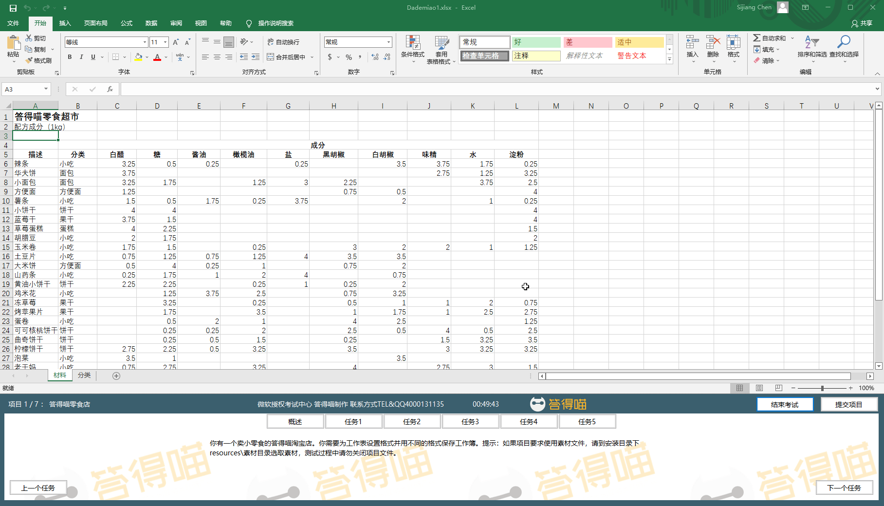
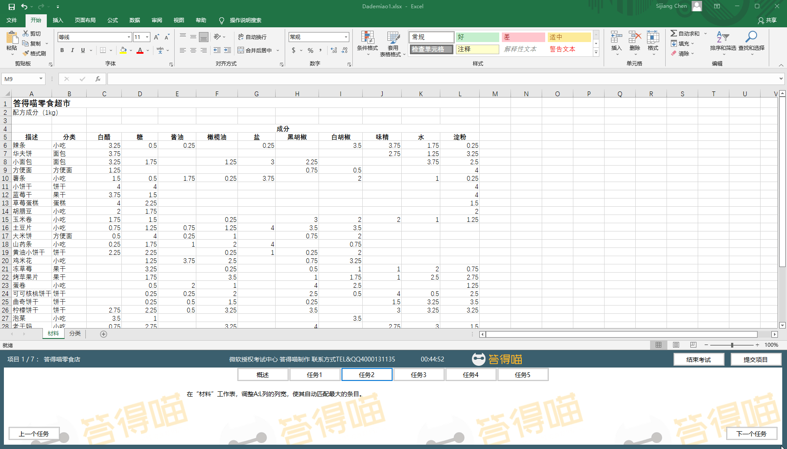
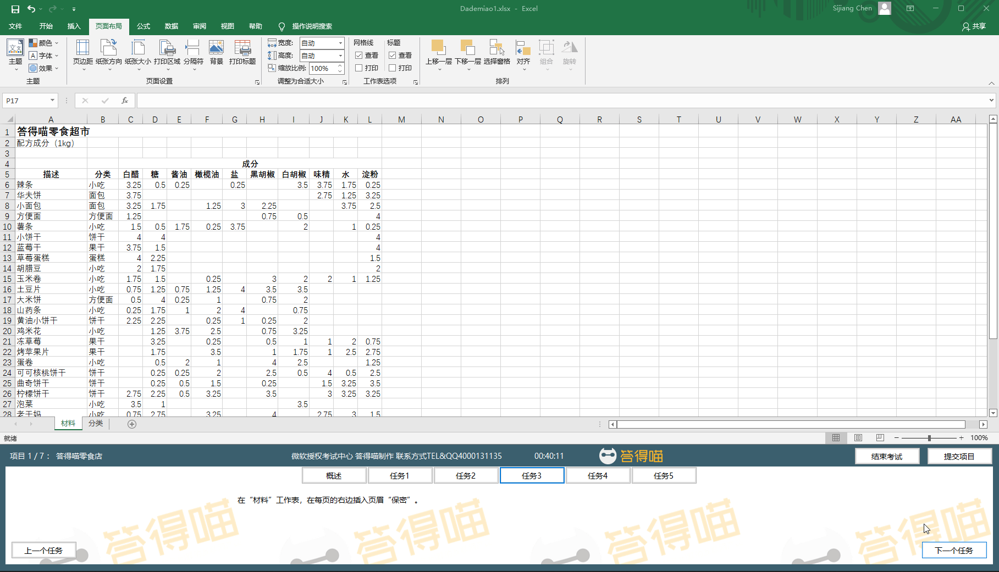
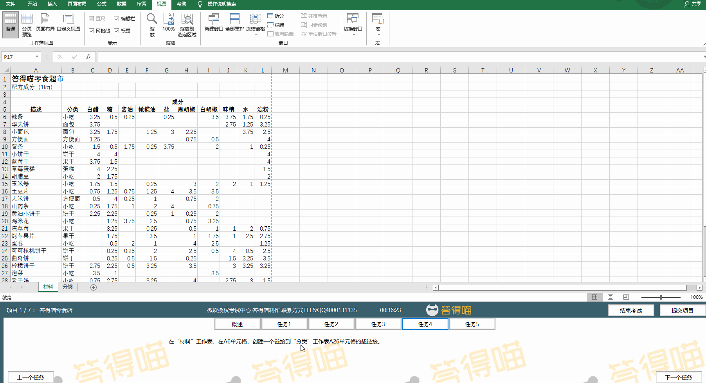
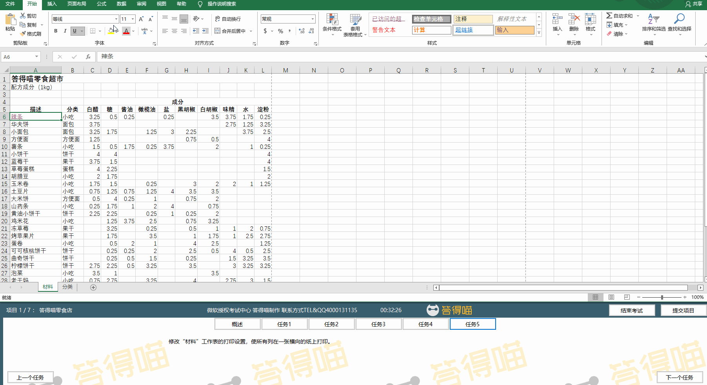

# Exercise File
[Core-Project1](MOS-Excel2016-Core-Project1.xlsx)

# Description

# Task 1

# Task 1 Answer

  
Click to see answer

# Task 2

# Task 2 Answer

  
Click to see answer

# Task 3

# Task 3 Answer

  
Click to see answer

# Task 4

# Task 4 Answer

  
Click to see answer

# Task 5

# Task 5 Answer

  
Click to see answer

