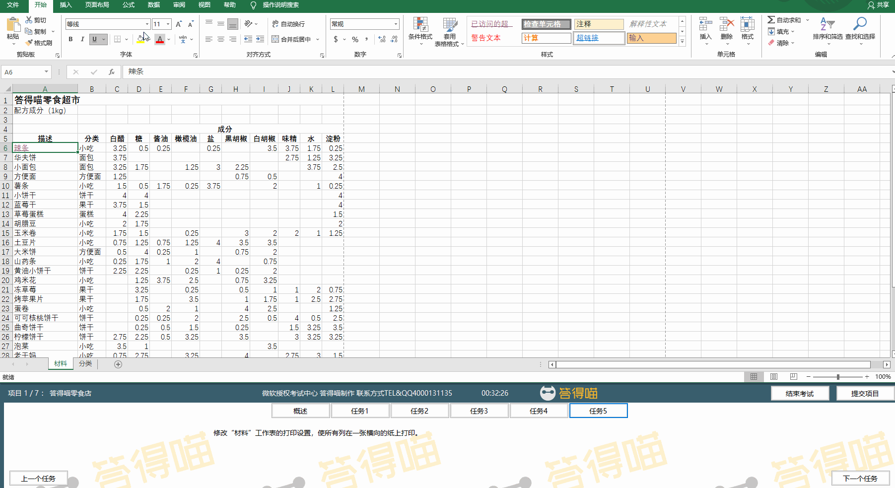

# Back to Main File
[Back](../README.md)

# Exercise File
[Core-Project1](MOS-Excel2016-Core-Project1.xlsx)

# Description
你有一个卖小零食的答得喵淘宝店。你需要为工作表设置格式并用不同的格式保存工作簿。

# Task 1
在“材料”工作表，将单元格区域A1:L1修改为一个单元格，但不要更改文本的对齐方式。

# Task 1 Answer

  
Click to see answer

# Task 2
在“材料”工作表，调整A:L列的列宽，使其自动匹配最大的条目。

# Task 2 Answer

  
Click to see answer

# Task 3
在“材料”工作表，在每页的右边插入页眉“保密”。

# Task 3 Answer

  
Click to see answer

# Task 4
在“材料”工作表，在A6单元格，创建一个链接到“分类”工作表A26单元格的超链接。

# Task 4 Answer

  
Click to see answer

# Task 5
修改“材料”工作表的打印设置，使所有列在一张横向的纸上打印。

# Task 5 Answer

  
Click to see answer

