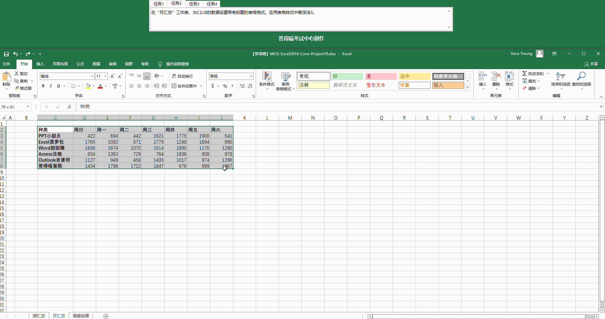

# Back to Main File
[Back](../README.md)

# Exercise File
[Core-Project10](MOS-Excel2016-Core-Project10.xlsx)

# Description
你管理答得喵面包店。你负责追踪产品销量并推荐新产品。每周三，你对数据汇总，和顾客调查保存在一起。
你有一个包含上周销售数据和调查报告的工作簿。
# Task 1
在”周汇总“工作表中，在不影响格式设置的情况下，补全”日平均“列的数据。
# Task 1 Answer

  
Click to see answer

# Task 2
在”月汇总“工作表，为C2:J8的数据设置带有标题的表格格式。应用表格样式中等深浅3。
# Task 2 Answer

  
Click to see answer

# Task 3
在“周汇总”工作表中，插入一个排列图，展示周三的销售数据分布。将图表标题更改为“周三销量”。
# Task 3 Answer

  
Click to see answer

# Task 4
在“调查结果”工作表的F6单元格，创建一个公式，以返回E6单元格最左侧的字符。
# Task 4 Answer

  
Click to see answer

