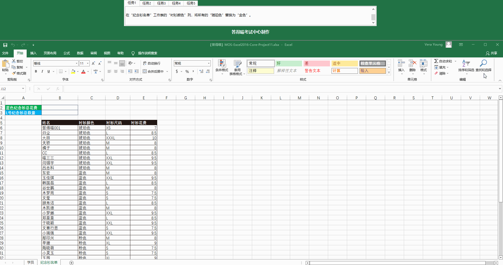
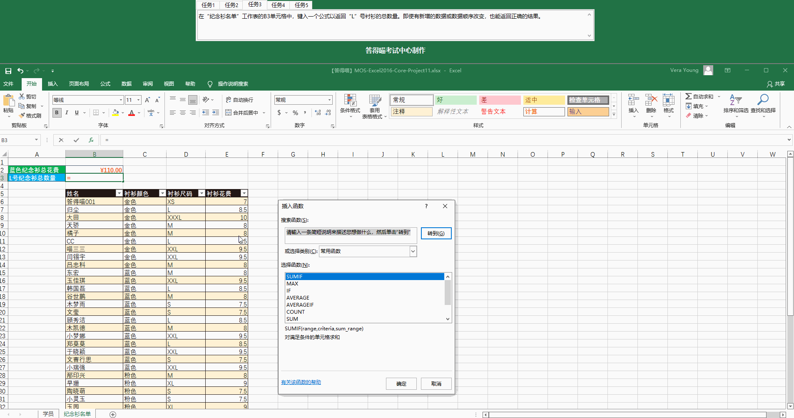
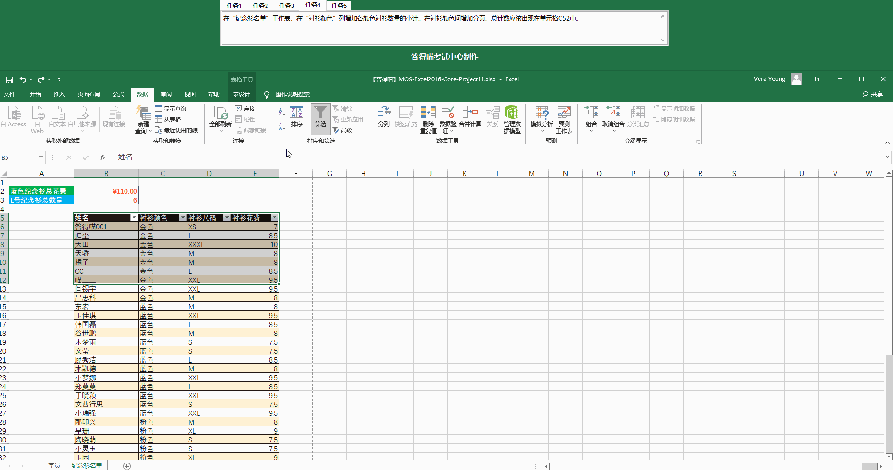
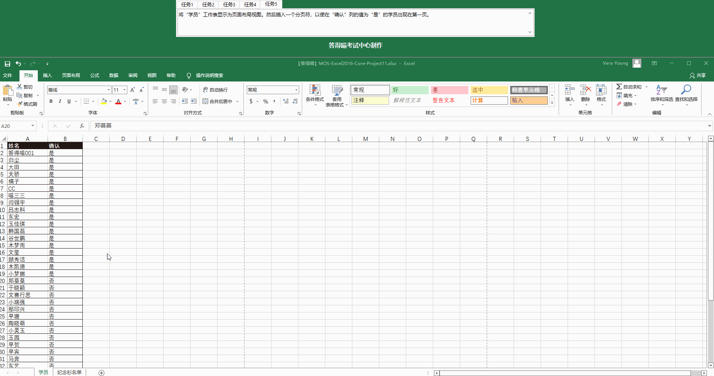

# Back to Main File
[Back](../README.md)

# Exercise File
[Core-Project11](MOS-Excel2016-Core-Project11.xlsx)

# Description
你的公司答得喵考试中心决定给在此通过MOS考试的同学提供纪念衬衫。你正在敲定最后的名单。
# Task 1
在“纪念衫名单”工作表的“衬衫颜色”列，将所有的“琥珀色”替换成“金色”。
# Task 1 Answer

  
Click to see answer

# Task 2
在“纪念衫名单”工作表的C2单元格中，键入一个公式以返回“蓝色”衬衫的总花费。
# Task 2 Answer

  
Click to see answer

# Task 3
在“纪念衫名单”工作表的C3单元格中，键入一个公式以返回“L”号衬衫的总数量。即使有新增的数据或数据
顺序改变，也能返回正确的结果。
# Task 3 Answer

  
Click to see answer

# Task 4
在“纪念衫名单”工作表，在“衬衫颜色”列增加各颜色衬衫数量的小计。在衬衫颜色间增加分页。总计数应该
出现在单元格C52中。
# Task 4 Answer

  
Click to see answer

# Task 5
将“学员”工作表显示为页面布局视图。然后键入一个分页符，以使在“确认”列的值为“是”的学院出现在第一页。
# Task 5 Answer

  
Click to see answer

