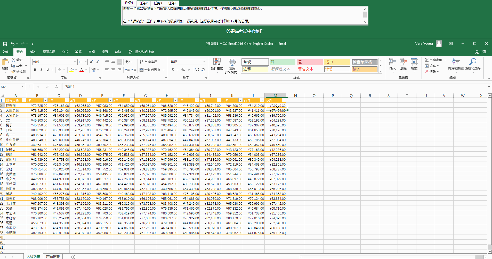
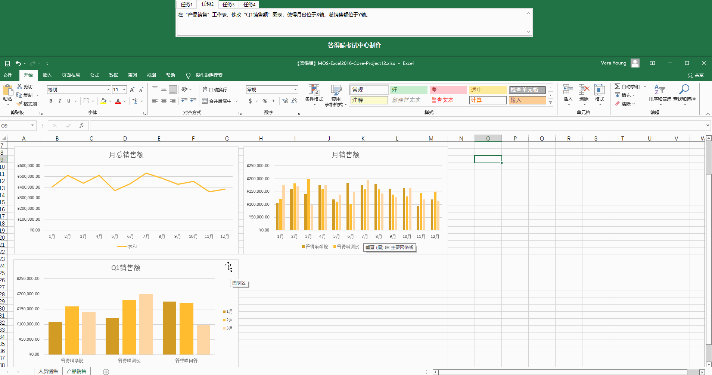
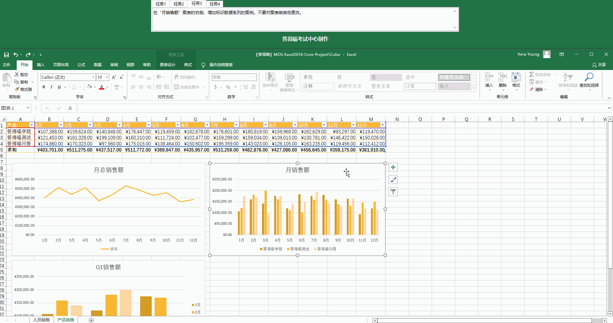
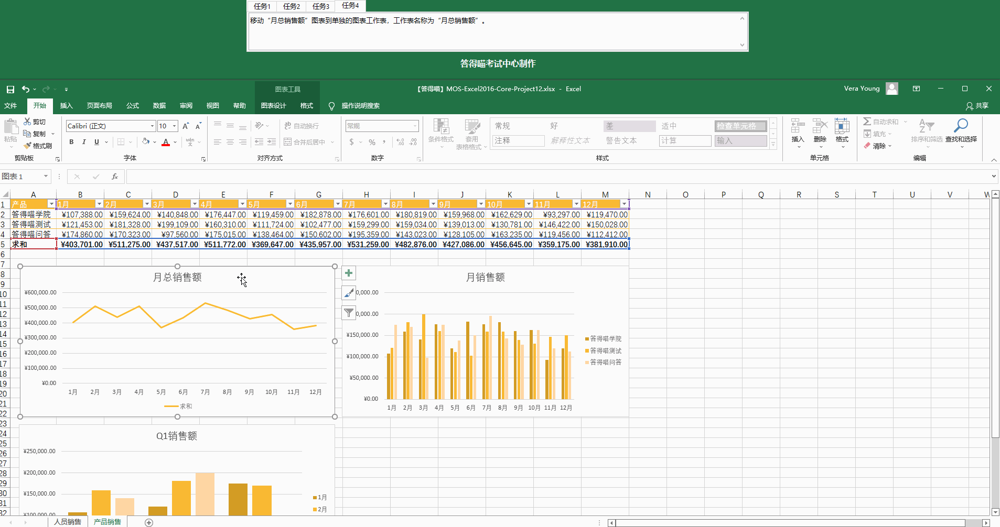

# Back to Main File
[Back](../README.md)

# Exercise File
[Core-Project12](MOS-Excel2016-Core-Project12.xlsx)

# Description
你有一个包含答得喵不同销售人员提供的历史销售数据的工作簿，你需要识别这些数据的趋势。
# Task 1
在“人员销售”工作表中表格的最后增加一行数据，这行数据自动计算出12月的总额。
# Task 1 Answer

  
Click to see answer

# Task 2
在“产品销售”工作表，修改“Q1销售额”图表，使得月份位于X轴，总销售额位于Y轴。
# Task 2 Answer

  
Click to see answer

# Task 3
在“月销售额”图表的右侧，增加标识数据系列的图例。不要对图表做其他更改。
# Task 3 Answer

  
Click to see answer

# Task 4
移动“月总销售额”图表到单独的图表工作表，工作表名称为“月总销售额”。
# Task 4 Answer

  
Click to see answer

