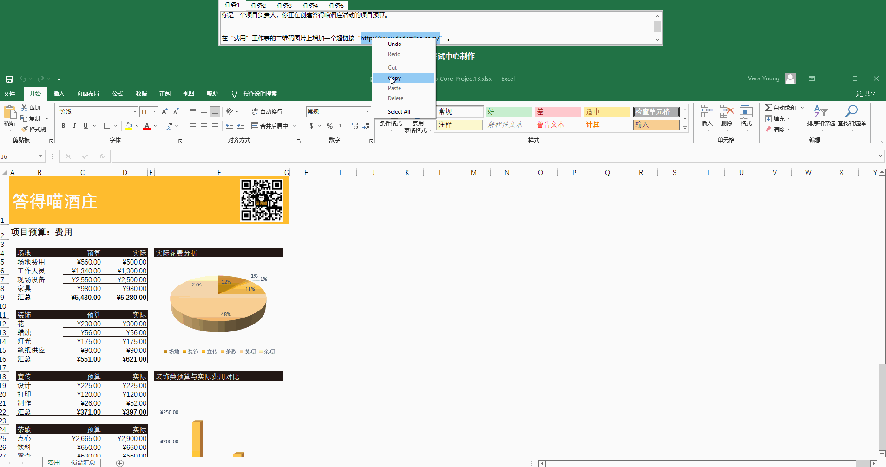
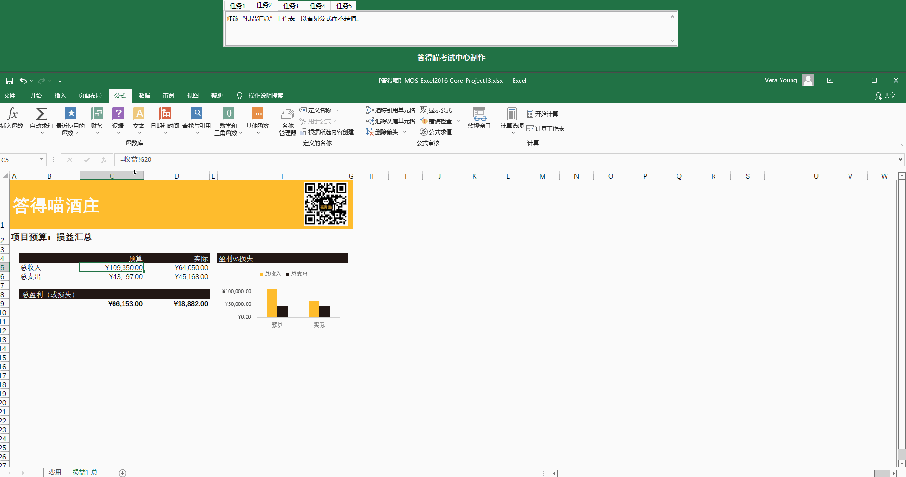
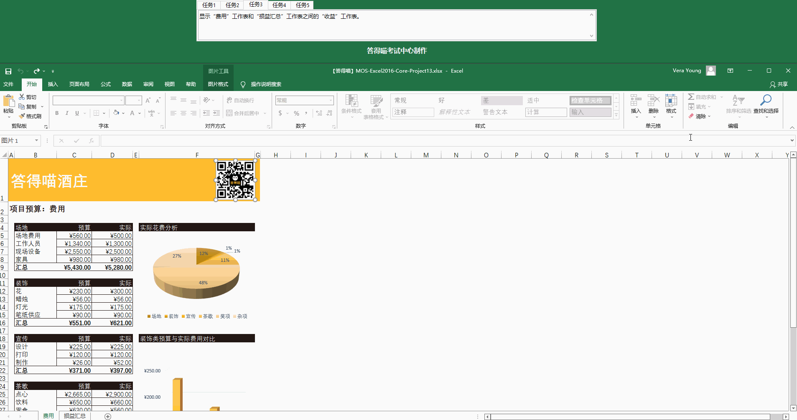
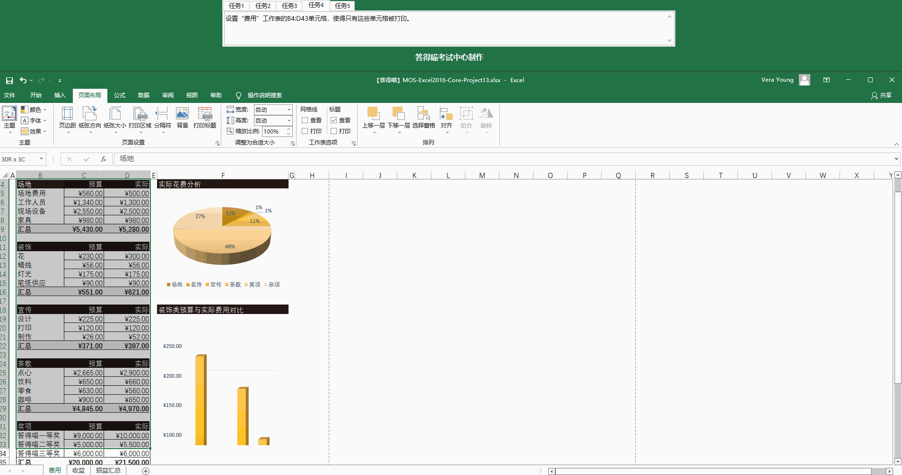
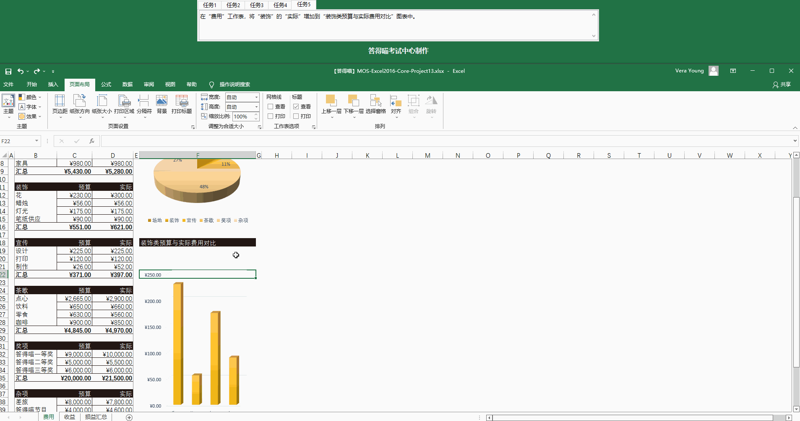

# Back to Main File
[Back](../README.md)

# Exercise File
[Core-Project13](MOS-Excel2016-Core-Project13.xlsx)

# Description
你是答得喵酒庄负责人，你正在创建答得喵酒庄活动的项目预算。
# Task 1
在“费用”工作表的二维码图片上增加一个超链接"http://www.dademiao.com/"。
# Task 1 Answer

  
Click to see answer

# Task 2
修改“损益汇总”工作表，只看见公式而不是值。
# Task 2 Answer

  
Click to see answer

# Task 3
显示“费用”工作表和“损益汇总”工作表之间的“收入”工作表。
# Task 3 Answer

  
Click to see answer

# Task 4
设置“费用”工作表的B4:D43单元格，使得只有这些单元格被打印。
# Task 4 Answer

  
Click to see answer

# Task 5
在“费用”工作表，将“装饰”的“实际”增加到“装饰类预算与实际费用对比”图表中。
# Task 5 Answer

  
Click to see answer

