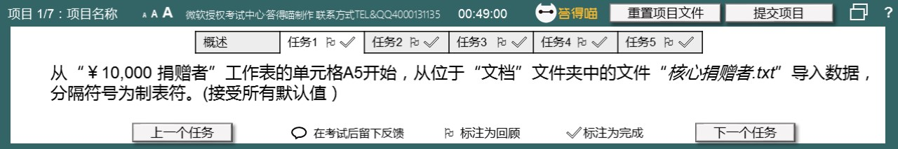

# Back to Main File
[Back](../README.md)

# Exercise File
[Core-Project14](MOS-Excel2016-Core-Project14.xlsx)

# Description
您是名为答得喵慈善的非盈利机构的执行助理。您正在更新内容为捐赠者名单的工作簿。

# Task 1
从“￥10,000 捐赠者”工作表的单元格A5开始，从位于素材文件夹中的文件“核心捐赠者.txt”导入数据，分隔符号为制表符。接受所有默认值。（素材文件夹点击【查询文件夹】查看）

# Task 1 Answer

  
Click to see answer

# Task 2
定位至名为“陕南”的单元格区域，清除其中的内容。

# Task 2 Answer

  
Click to see answer

# Task 3
创建名“￥2000 捐赠者”的新工作表。

# Task 3 Answer

  
Click to see answer

# Task 4
在“￥10,000 捐赠者”工作表中，为单元格B3创建链接，链接到电子邮件地址“tianjiao@dademiao.com”。

# Task 4 Answer

  
Click to see answer

# Task 5
整理工作表，使“￥10,000 捐赠者”位于最前面。

# Task 5 Answer

  
Click to see answer

