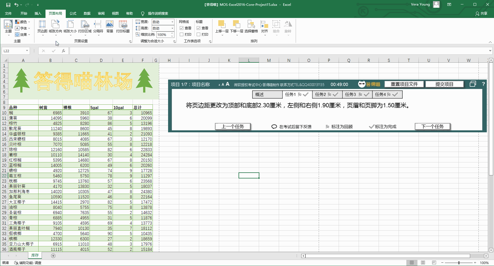
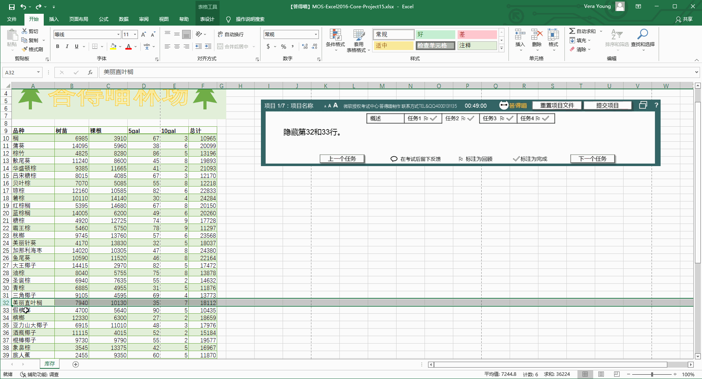
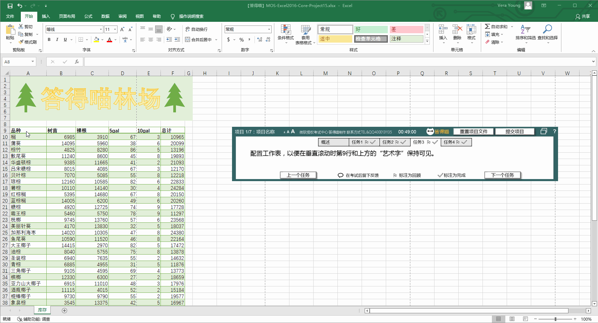
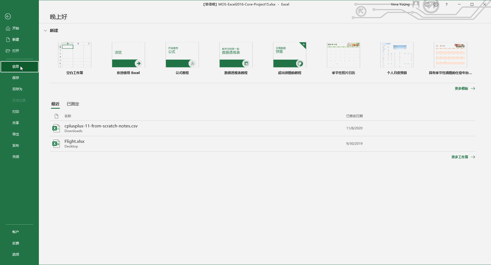

# Back to Main File
[Back](../README.md)

# Exercise File
[Core-Project15](MOS-Excel2016-Core-Project15.xlsx)

# Description
您正在更新答得喵林场的库存工作表。

# Task 1
将页边距更改为顶部和底部2.30厘米，左侧和右侧1.90厘米，页眉和页脚为1.50厘米。

# Task 1 Answer

  
Click to see answer

# Task 2
隐藏第32和33行。

# Task 2 Answer

  
Click to see answer

# Task 3
配置工作表，以便在垂直滚动时第9行和上方的“艺术字”保持可见。

# Task 3 Answer

  
Click to see answer

# Task 4
检查电子表格的辅助功能。通过添加文本“答得喵林场”作为可选文字，更正错误。无需修复警告。

# Task 4 Answer

  
Click to see answer

