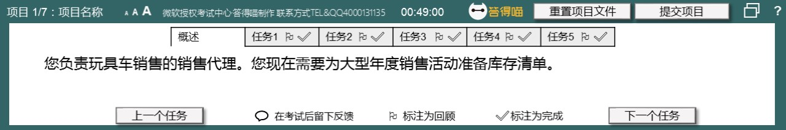
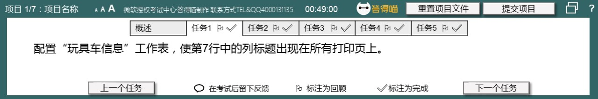
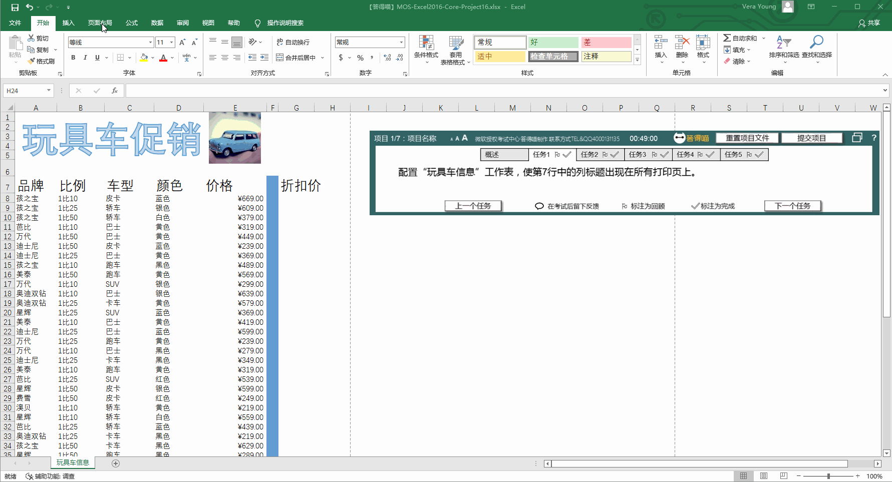
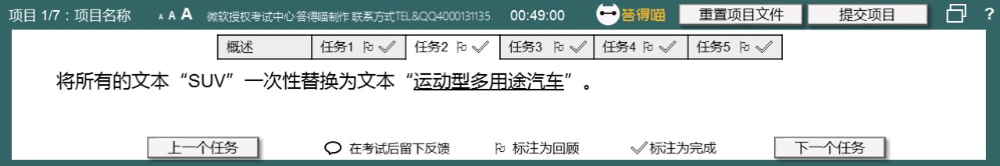
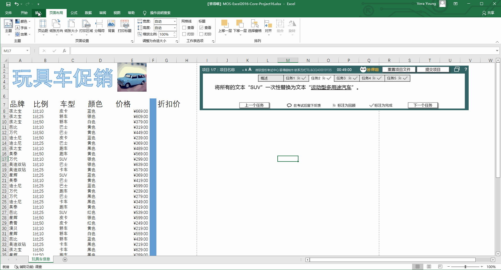
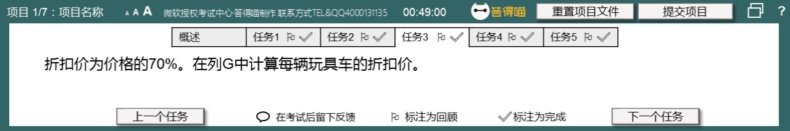
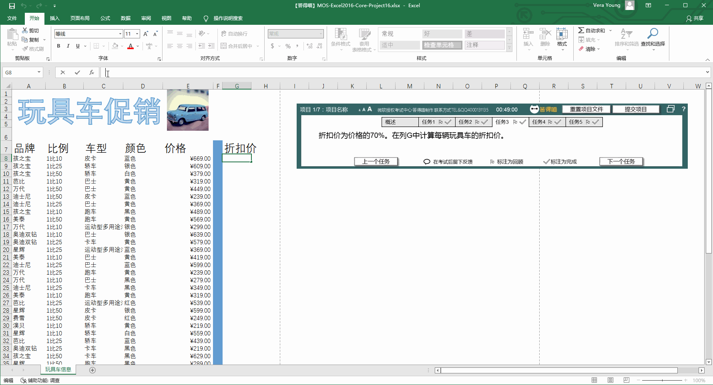
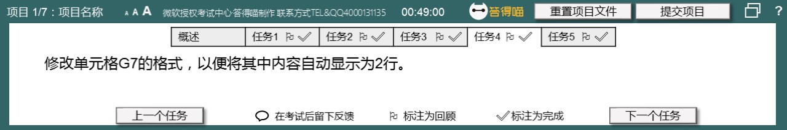
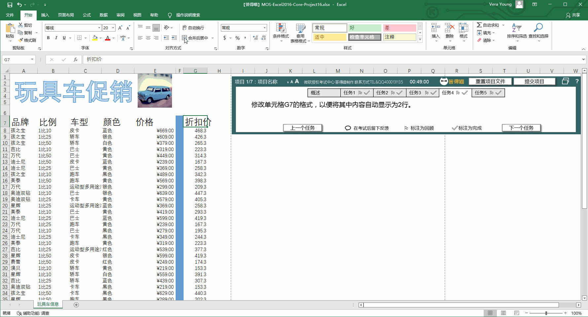
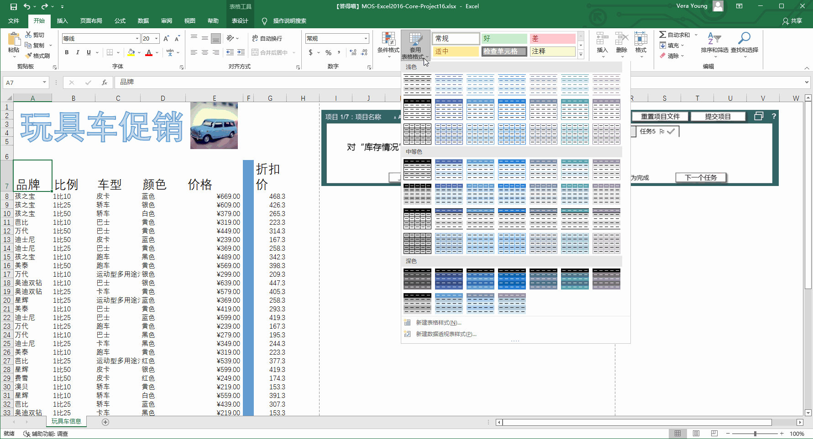

# Back to Main File
[Back](../README.md)

# Exercise File
[Core-Project16](MOS-Excel2016-Core-Project16.xlsx)

# Description
您负责玩具车销售的销售代理。您现在需要为大型年度销售活动准备库存清单。

# Task 1
配置“玩具车信息”工作表，使第7行中的列标题出现在所有打印页上。

# Task 1 Answer

  
Click to see answer

# Task 2
将所有的文本“SUV”一次性替换为文本“运动型多用途汽车”。

# Task 2 Answer

  
Click to see answer

# Task 3
折扣价为价格的70%。在列G中计算每辆玩具车的折扣价。

# Task 3 Answer

  
Click to see answer

# Task 4
修改单元格G7的格式，以便将其中内容自动显示为2行。

# Task 4 Answer

  
Click to see answer

# Task 5
对“库存情况”表应用“浅蓝，表样式浅色17”。

# Task 5 Answer

  
Click to see answer

