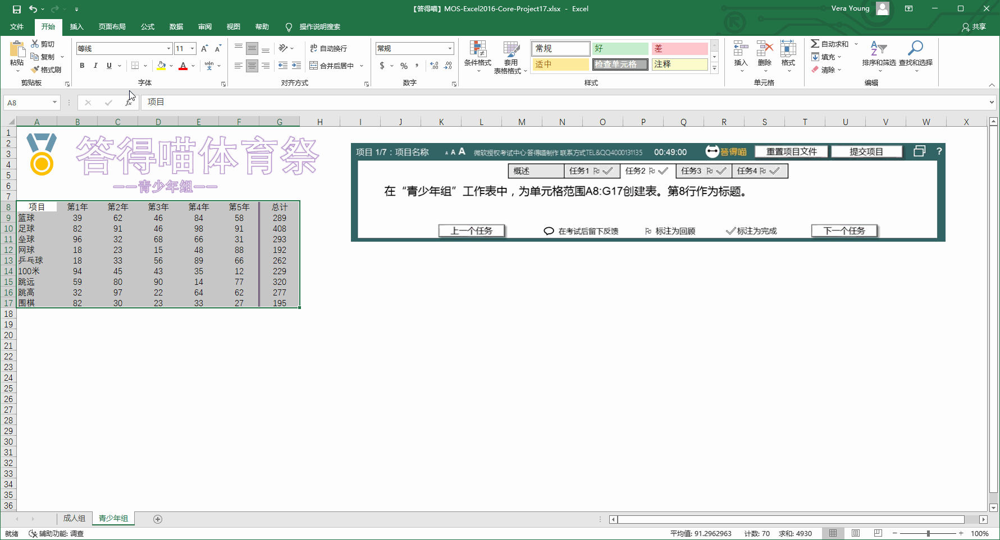

# Back to Main File
[Back](../README.md)

# Exercise File
[Core-Project17](MOS-Excel2016-Core-Project17.xlsx)

# Description
你正在分析答得喵体育祭成人和青少年体育项目在过去五年的报名变化情况。

# Task 1
在“成人组”工作表上，为每种运动插入“柱形图”迷你图，显示过去五年的报名情况。

# Task 1 Answer

  
Click to see answer

# Task 2
在“青少年组”工作表中，为单元格范围A8:G17创建表。第8行作为标题。

# Task 2 Answer

  
Click to see answer

# Task 3
取消隐藏“摘要”工作表。

# Task 3 Answer

  
Click to see answer

# Task 4
为“成人组情况”表添加可选文字“成人组情况”。

# Task 4 Answer

  
Click to see answer

