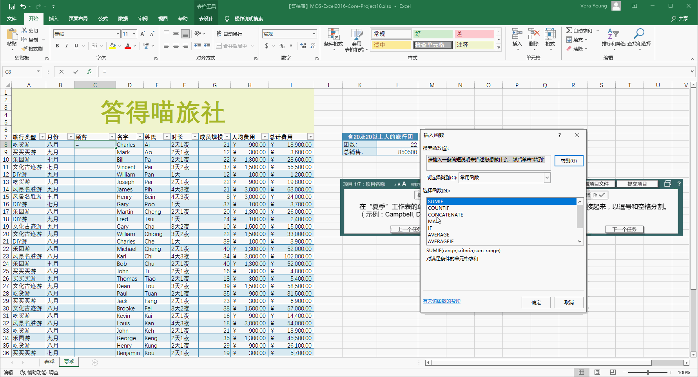
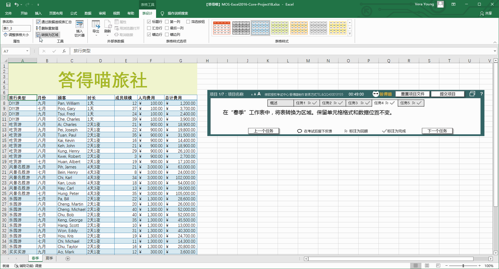
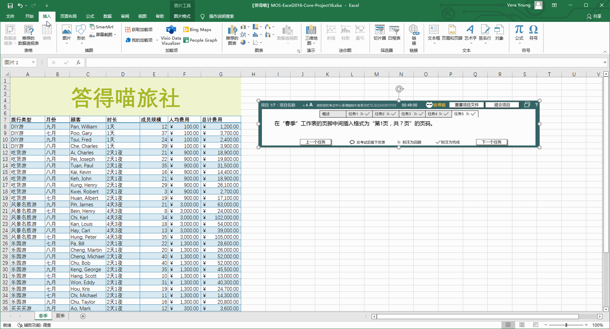

# Back to Main File
[Back](../README.md)

# Exercise File
[Core-Project18](MOS-Excel2016-Core-Project18.xlsx)

# Description
您是小型旅行社的管理者，正在整理未来六个月的旅行预订情况。

# Task 1
在“夏季”工作表的单元格L8上，插入函数，以计算含20人或以上人数的旅行团的数量，当记录发生增减或修改时须自动更新计算结果。

# Task 1 Answer

  
Click to see answer

# Task 2
在“夏季”工作表的单元格L9上，插入函数，以计算含20人或以上人数的旅行团的销售总额，当记录发生增减或修改时须自动更新计算结果。

# Task 2 Answer

  
Click to see answer

# Task 3
在“夏季”工作表的单元格C8上，插入函数，以将顾客的“姓氏”和“名字”连接起来，以逗号和空格分割。（示例：Campbell, David ，前面为姓氏）。

# Task 3 Answer

  
Click to see answer

# Task 4
在“春季”工作表中，将表转换为区域。保留单元格格式和数据位置不变。

# Task 4 Answer

  
Click to see answer

# Task 5
在“春季”工作表的页脚中间插入格式为“第1页，共？页”的页码。

# Task 5 Answer

  
Click to see answer

