# Back to Main File
[Back](../README.md)

# Exercise File
[Core-Project19](MOS-Excel2016-Core-Project19.xlsx)

# Description
您是答得喵农贸市场的主管。您正在使用Excel分析、统计本季度各产品的销售情况。

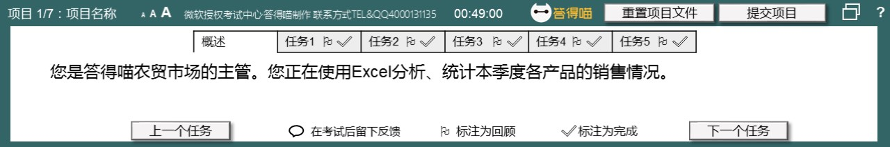
# Task 1
在“夏季”工作表中，仅使用“品类”和“总计”列中的数据创建三维饼图。将新图表放在柱形图的右侧。
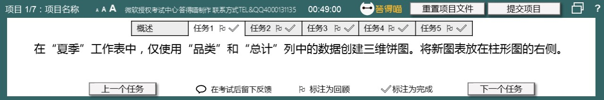
# Task 1 Answer

  
Click to see answer

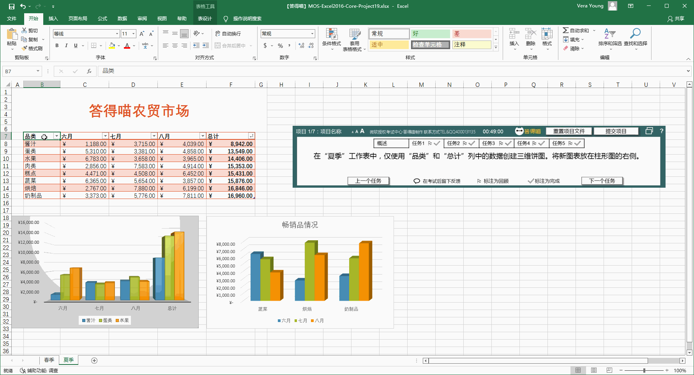

# Task 2
在“夏季”工作表中，在“畅销品情况”图表中添加“总计”数据序列。仅包括“蔬菜”、“烘焙”、“奶制品”三项的数值。

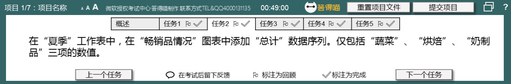
# Task 2 Answer

  
Click to see answer

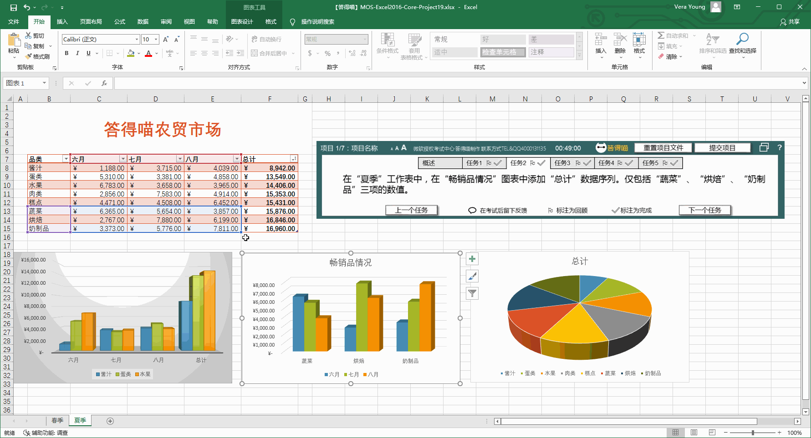

# Task 3
在“春季”工作表中，将标题“新产品情况”添加到柱形图中。为垂直轴添加轴标题，内容为“销售额”，为水平轴添加轴标题，内容为“月份”。

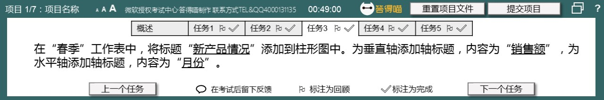
# Task 3 Answer

  
Click to see answer

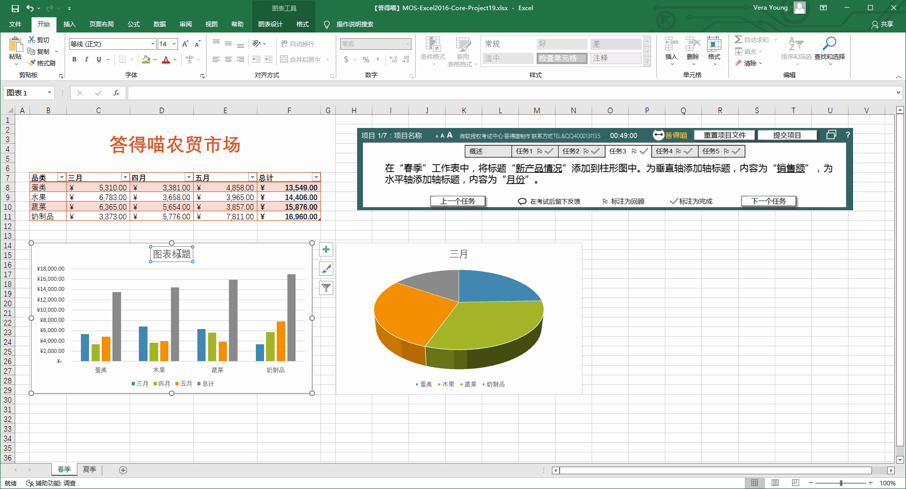

# Task 4
在“春季”工作表中，对三维饼图应用“样式3”和“单色调色板1”。

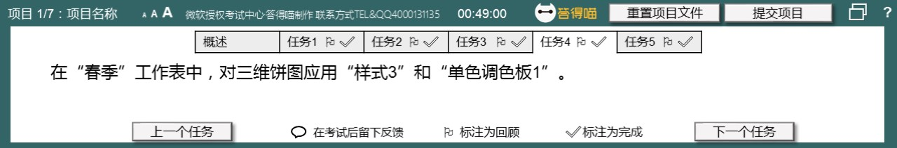
# Task 4 Answer

  
Click to see answer

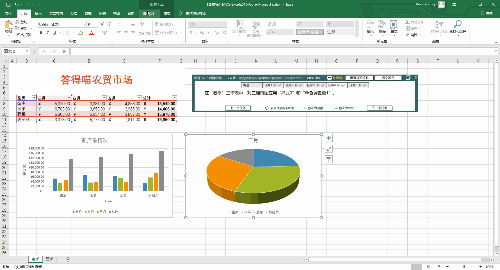

# Task 5
在“夏季”工作表中 ，切换第一张柱形图的行和列。

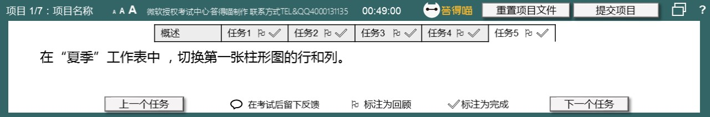
# Task 5 Answer

  
Click to see answer

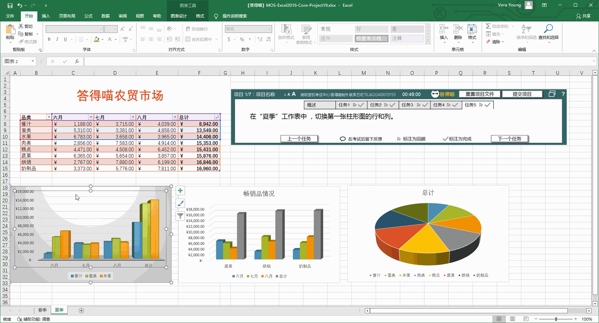

