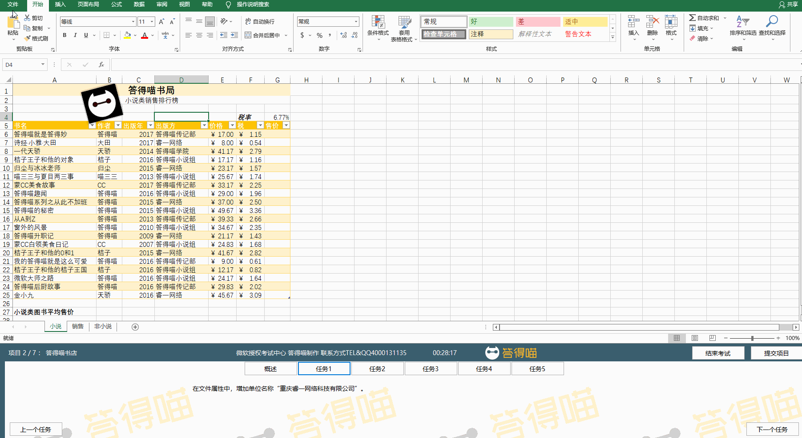
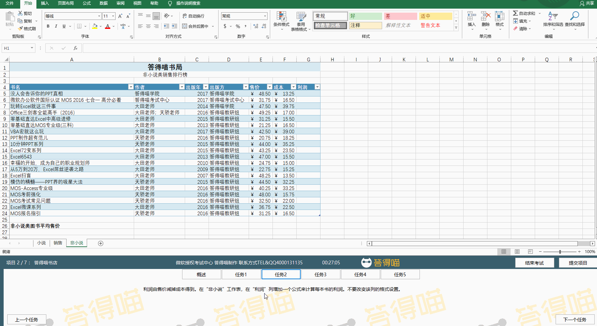
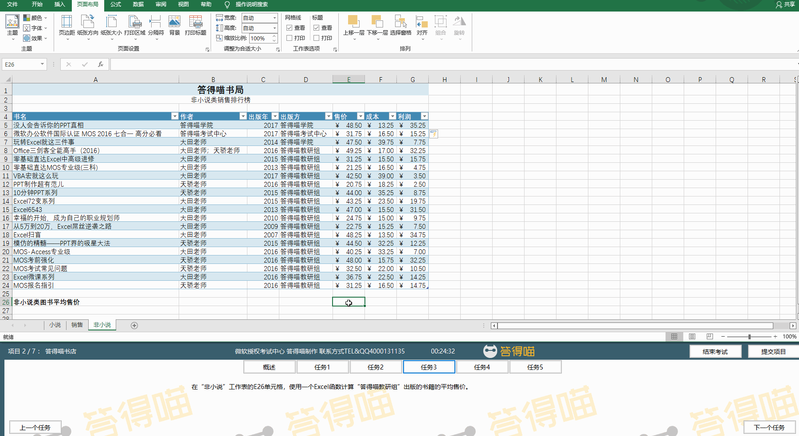
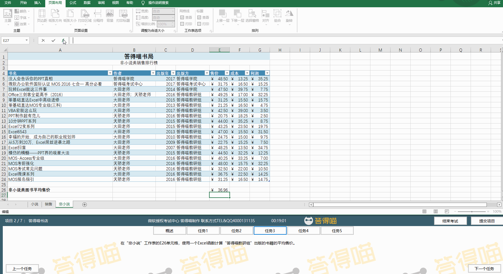
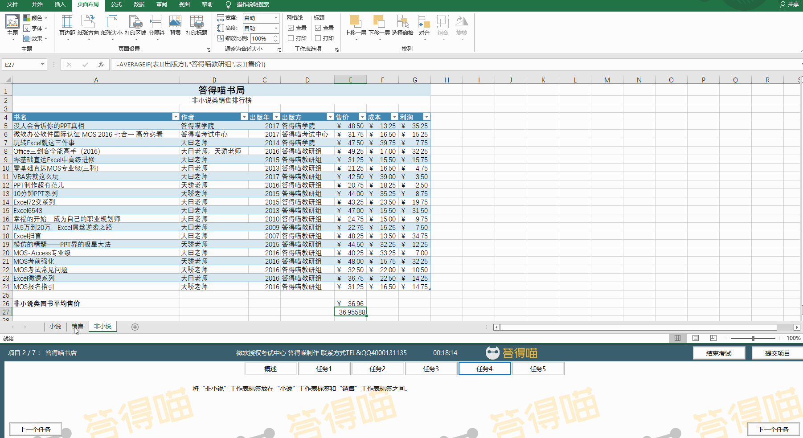

# Back to Main File
[Back](../README.md)

# Exercise File
[Core-Project2](MOS-Excel2016-Core-Project2.xlsx)

# Description
你有一个答得喵书店。你正在更新销售工作簿。

# Task 1
在文件属性中，增加单位名称“重庆睿一网络科技有限公司”。

# Task 1 Answer

  
Click to see answer

# Task 2
利润由售价减掉成本得到。在“非小说”工作表，在“利润”列增加一个公式来计算每本书的利润。不要改变该列的格式设置。

# Task 2 Answer

  
Click to see answer

# Task 3
在“非小说”工作表的E26单元格，使用一个Excel函数计算“答得喵教研组”出版的书籍的平均售价。

# Task 3 Answer

  
Click to see answer

Method1:

Method2:

# Task 4
将“非小说”工作表标签放在“小说”工作表标签和“销售”工作表标签之间。

# Task 4 Answer

  
Click to see answer

# Task 5
在“小说”工作表，更改图片的旋转角度为0°。

# Task 5 Answer

  
Click to see answer

