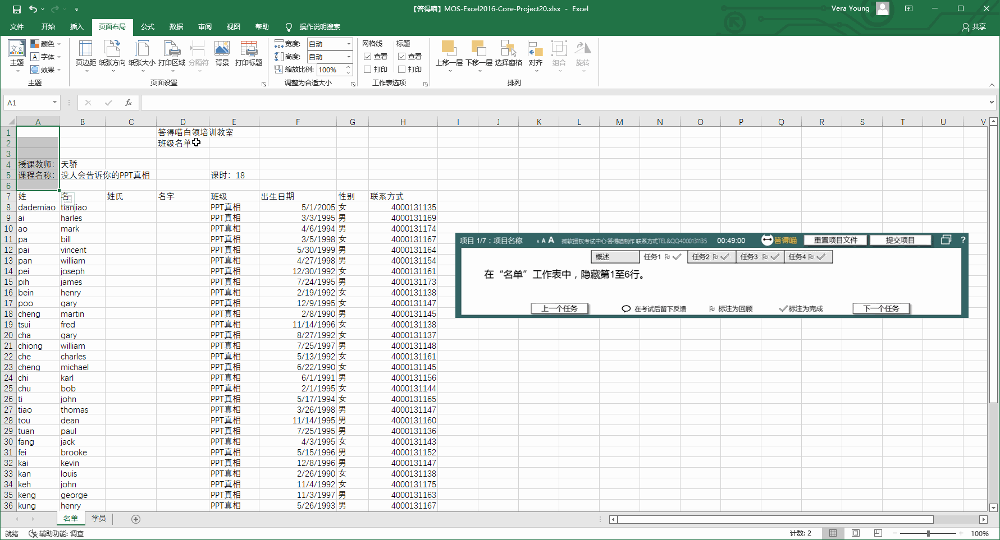
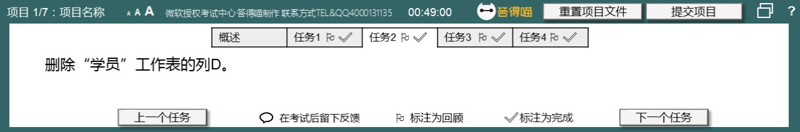

# Back to Main File
[Back](../README.md)

# Exercise File
[Core-Project20](MOS-Excel2016-Core-Project20.xlsx)

# Description
你是答得喵白领培训教室的老师，你下载了其中一个班级的名册。并准备将其导入新的系统中。

# Task 1
在“名单”工作表中，隐藏第1至6行。

# Task 1 Answer

  
Click to see answer

# Task 2
删除“学员”工作表的列D。

# Task 2 Answer

  
Click to see answer

# Task 3
在“名单”工作表的单元格C8中，用函数填入单元格A8的内容，使得仅第一个字母大写。

# Task 3 Answer

  
Click to see answer

# Task 4
设置“名单”工作表，以在每张打印页上都显示第7行。

# Task 4 Answer

  
Click to see answer

