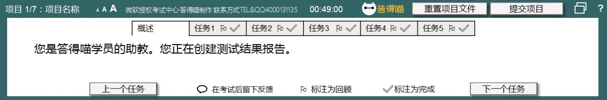
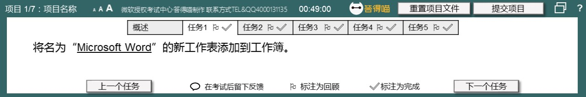
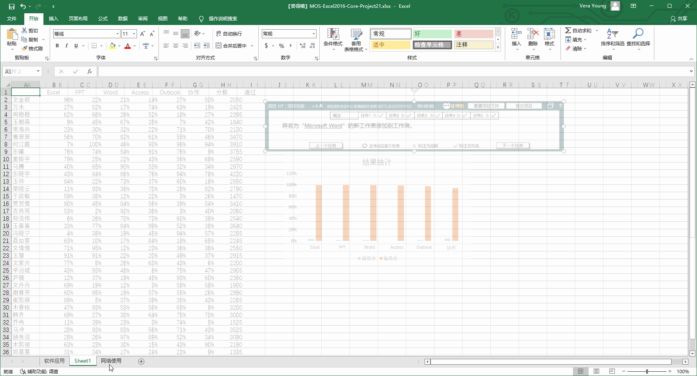
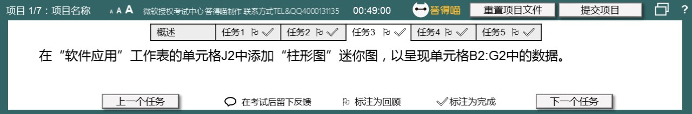
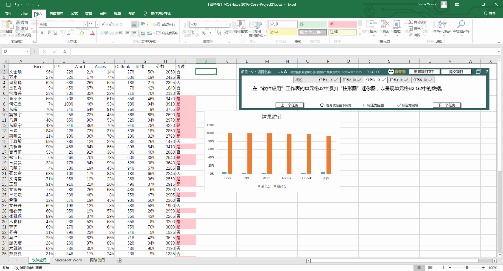
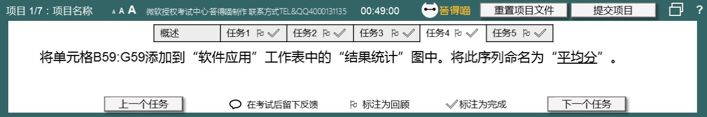
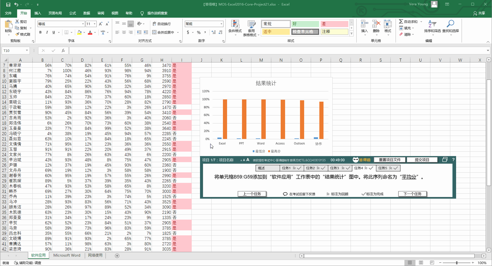
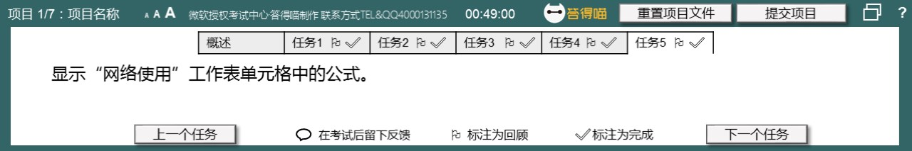
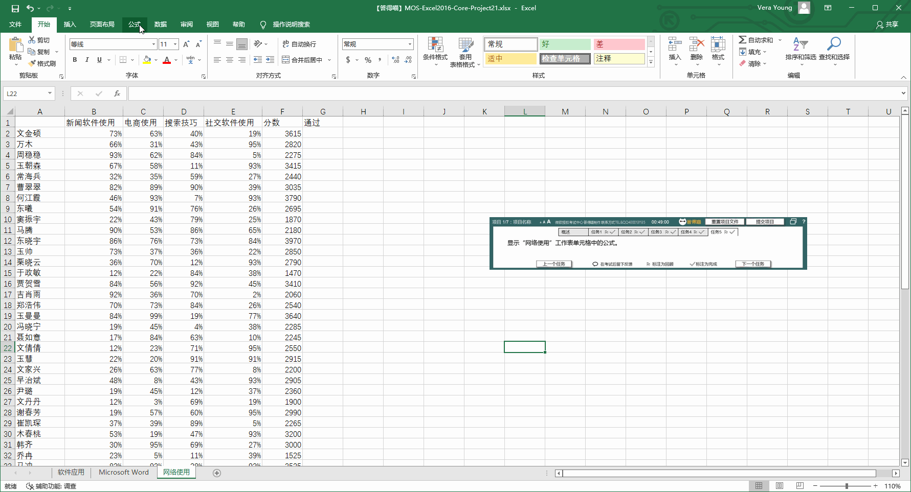

# Back to Main File
[Back](../README.md)

# Exercise File
[Core-Project21](MOS-Excel2016-Core-Project21.xlsx)

# Description
您是答得喵学员的助教。您正在创建测试结果报告。

# Task 1
将名为“Microsoft Word”的新工作表添加到工作簿。

# Task 1 Answer

  
Click to see answer

# Task 2
在“软件应用”工作表的单元格I2中添加函数，若单元格H2的值高于2500，将显示“是”，否则，显示“否”。填充列I中的单元格，以显示是否每个学生已通过。

# Task 2 Answer

  
Click to see answer

# Task 3
在“软件应用”工作表的单元格J2中添加“柱形图”迷你图，以呈现单元格B2:G2中的数据。

# Task 3 Answer

  
Click to see answer

# Task 4
将单元格B59:G59添加到“软件应用”工作表中的“结果统计”图中。将此序列命名为“平均分”。

# Task 4 Answer

  
Click to see answer

# Task 5
显示“网络使用”工作表单元格中的公式。

# Task 5 Answer

  
Click to see answer

