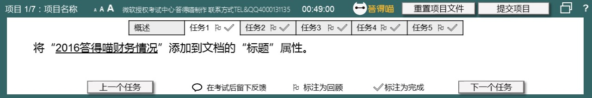
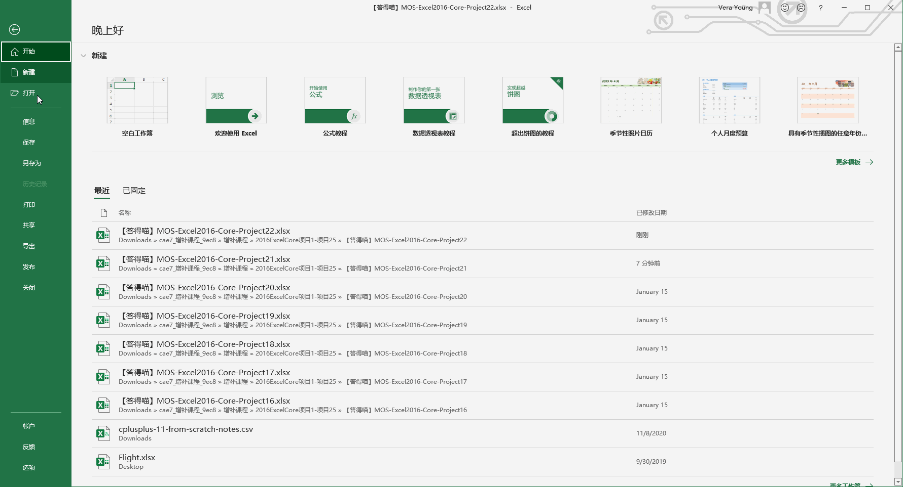
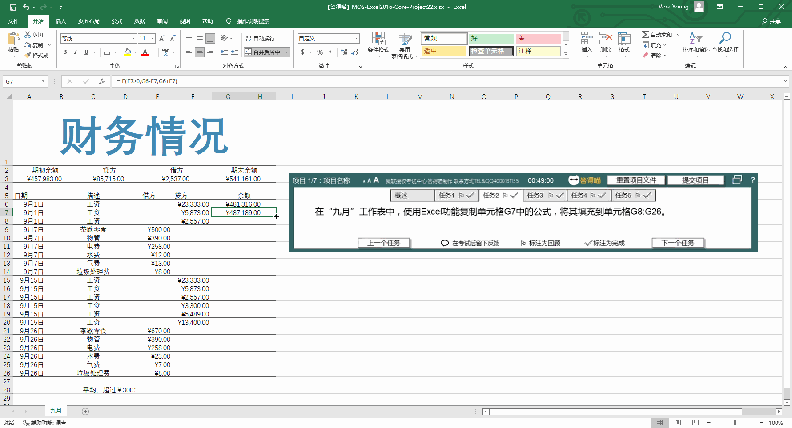
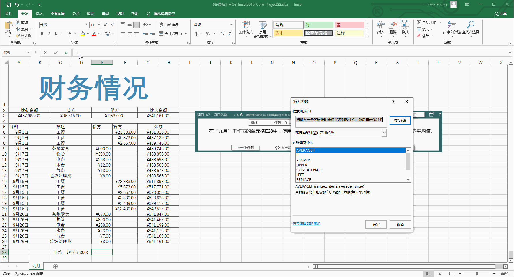
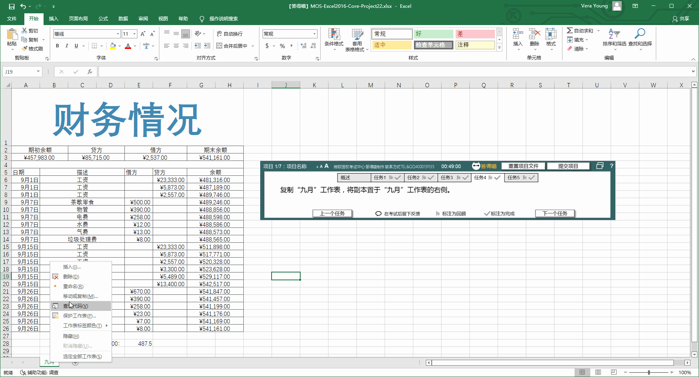
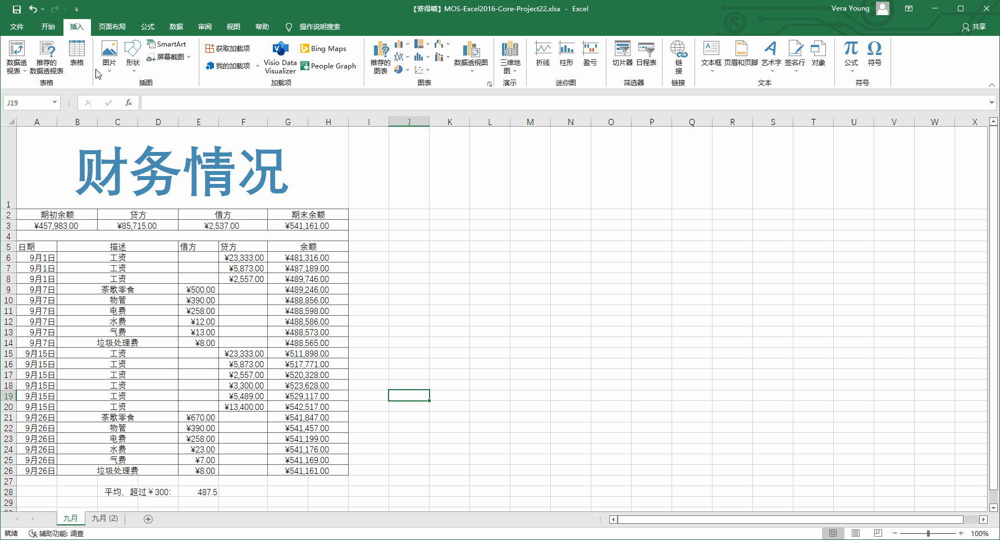

# Back to Main File
[Back](../README.md)

# Exercise File
[Core-Project22](MOS-Excel2016-Core-Project22.xlsx)

# Description
您是财务顾问，正在审查客户的银行对账单。

# Task 1
将“2016答得喵财务情况”添加到文档的“标题”属性。

# Task 1 Answer

  
Click to see answer

# Task 2
在“九月”工作表中，使用Excel功能复制单元格G7中的公式，将其填充到单元格G8:G26。

# Task 2 Answer

  
Click to see answer

# Task 3
在“九月”工作表的单元格E28中，使用函数计算单元格范围E6:E26中，借方数值超过￥300的数值的平均值。

# Task 3 Answer

  
Click to see answer

# Task 4
复制“九月”工作表，将副本置于“九月”工作表的右侧。

# Task 4 Answer

  
Click to see answer

# Task 5
将素材文件夹的“硬币.png”图片添加到“九月”工作表中“财务情况”标题右侧。（素材文件夹点击【查询文件夹】查看）

# Task 5 Answer

  
Click to see answer

