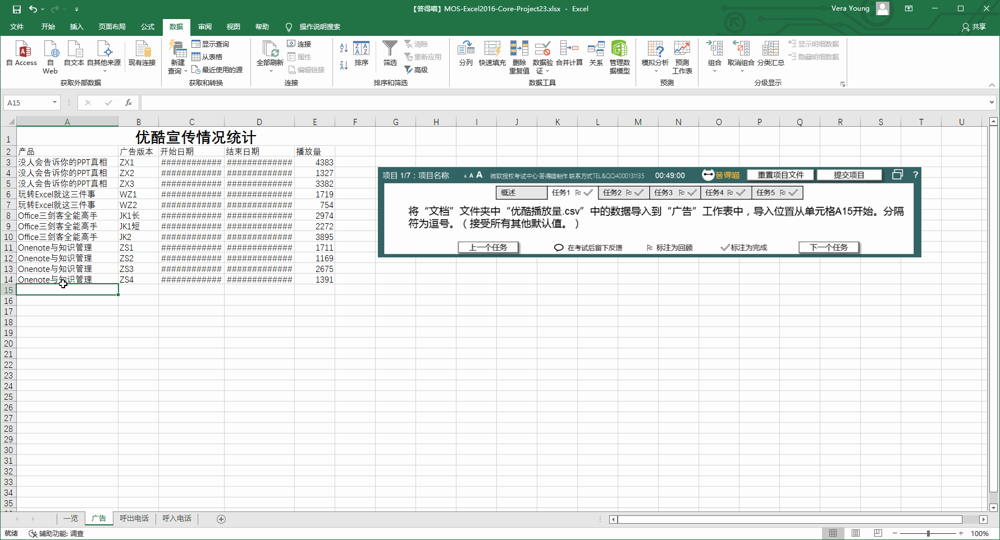
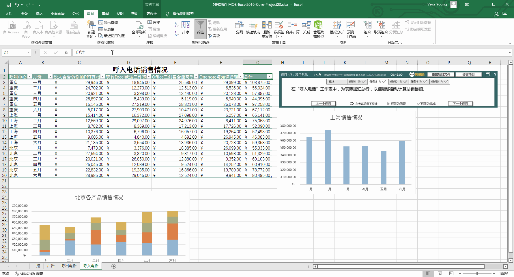
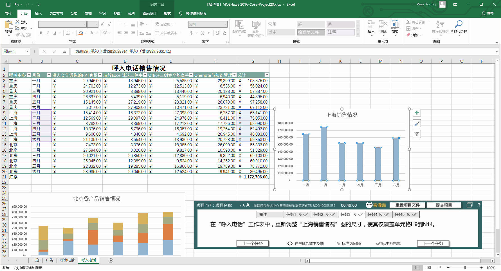
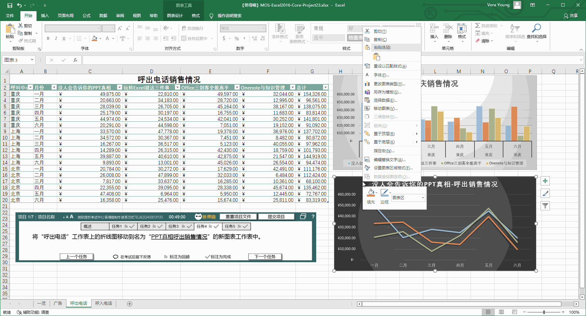
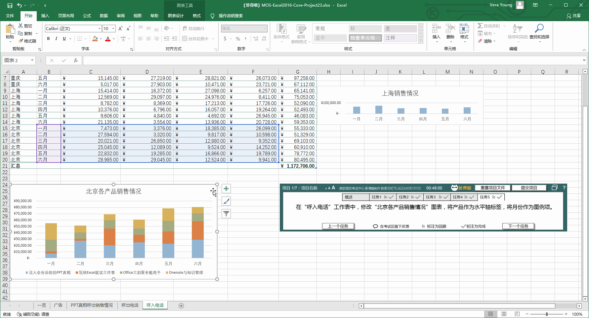

# Back to Main File
[Back](../README.md)

# Exercise File
[Core-Project23](MOS-Excel2016-Core-Project23.xlsx)

# Description
您在答得喵的市场部工作。答得喵在优酷、电视和地铁上投放广告。答得喵有三个呼叫中心，处理呼入和呼出的销售电话。您需要创建显示一月到六月销量和营销数据报告。

# Task 1
将素材文件夹中“优酷播放量.csv”中的数据导入到“广告”工作表中，导入位置从单元格A15开始。分隔符为逗号。接受所有其他默认值。（素材文件夹点击【查询文件夹】查看）

# Task 1 Answer

  
Click to see answer

# Task 2
在“呼入电话”工作表中，为表添加汇总行，以便能够自动计算总销售额。

# Task 2 Answer

  
Click to see answer

# Task 3
在“呼入电话”工作表中，重新调整“上海销售情况”图的尺寸，使其仅覆盖单元格H9到N14。

# Task 3 Answer

  
Click to see answer

# Task 4
将“呼出电话”工作表上的折线图移动到名为“PPT真相呼出销售情况”的新图表工作表中。

# Task 4 Answer

  
Click to see answer

# Task 5
在“呼入电话”工作表中，修改“北京各产品销售情况”图表，将产品作为水平轴标签，将月份作为图例项。

# Task 5 Answer

  
Click to see answer

