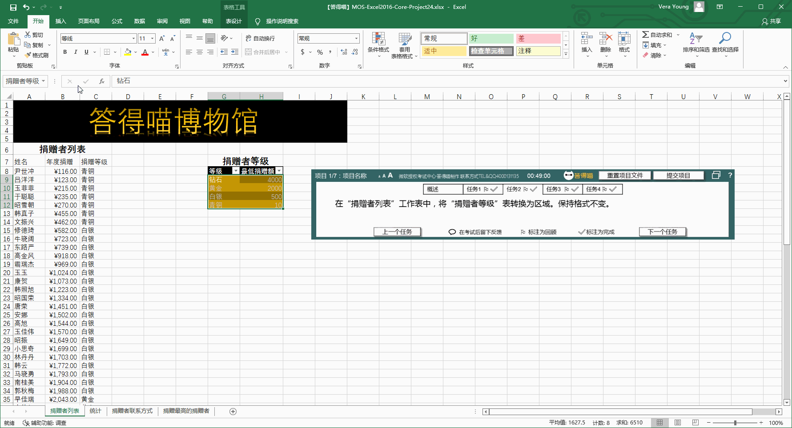

# Back to Main File
[Back](../README.md)

# Exercise File
[Core-Project24](MOS-Excel2016-Core-Project24.xlsx)

# Description
答得喵博物馆由捐赠者提供部分资金。捐赠者有机会参加特别活动。您正在创建年度报告，以显示捐赠者捐款和参与情况。

# Task 1
在“捐赠者联系方式”工作表中，将名为“手机”的列添加到“固定电话”列的右侧。

# Task 1 Answer

  
Click to see answer

# Task 2
在“捐赠者列表”工作表中，将“捐赠者等级”表转换为区域。保持格式不变。

# Task 2 Answer

  
Click to see answer

# Task 3
将“捐赠者列表”工作表上的A70:C74区域中的内容复制到“捐赠最高的捐赠者”工作表的A2:C6区域。

# Task 3 Answer

  
Click to see answer

# Task 4
在“统计”工作表上，创建“三维簇状柱形图”，该图表显示各个年龄组的总捐赠。年龄组应当在水平轴上从小到大列出。将图标题更改为“按年龄组的总捐赠”。

# Task 4 Answer

  
Click to see answer

