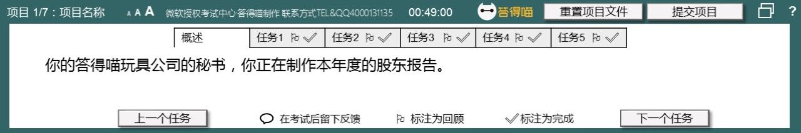
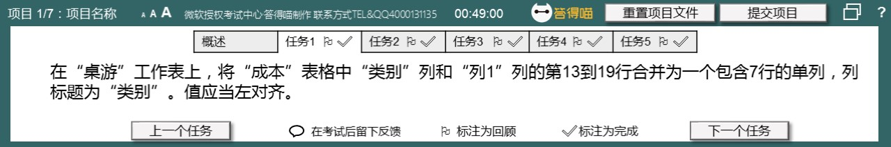
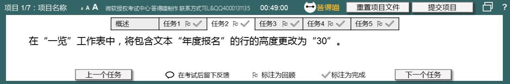
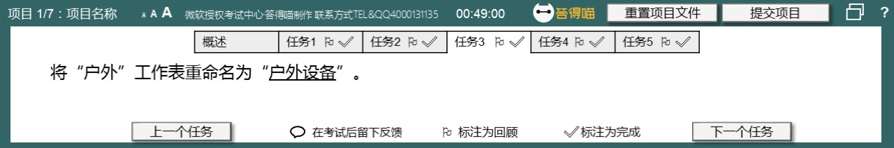
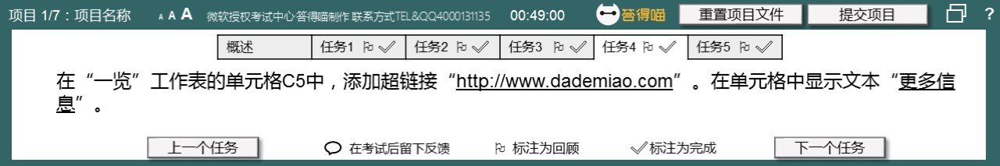
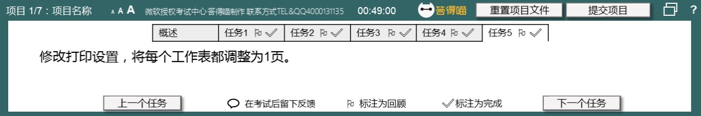
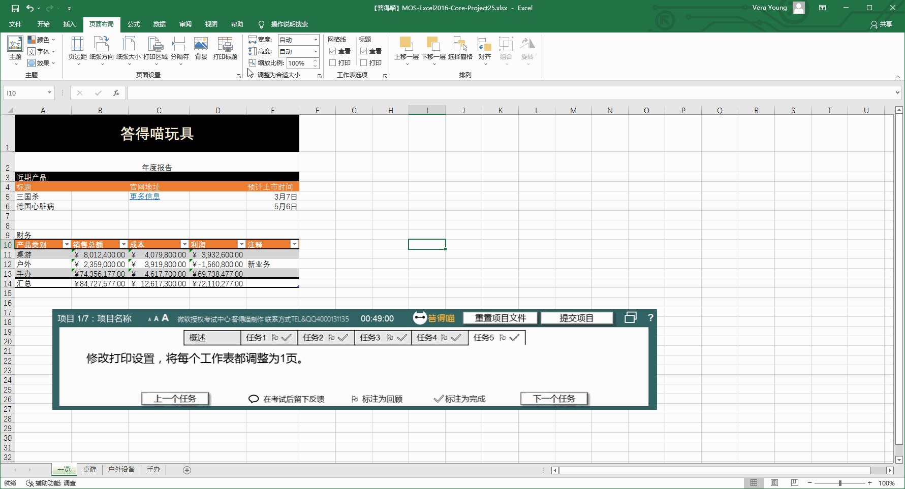

# Back to Main File
[Back](../README.md)

# Exercise File
[Core-Project25](MOS-Excel2016-Core-Project25.xlsx)

# Description
你的答得喵玩具公司的秘书，你正在制作本年度的股东报告。

# Task 1
在“桌游”工作表上，将“成本”表格中“类别”列和“列1”列的第13到19行合并为一个包含7行的单列，列标题为“类别”。值应当左对齐。

# Task 1 Answer

  
Click to see answer

# Task 2
在“一览”工作表中，将包含文本“年度报名”的行的高度更改为“30”。

# Task 2 Answer

  
Click to see answer

# Task 3
将“户外”工作表重命名为“户外设备”。

# Task 3 Answer

  
Click to see answer

# Task 4
在“一览”工作表的单元格C5中，添加超链接“http://www.dademiao.com”。在单元格中显示文本“更多信息”。

# Task 4 Answer

  
Click to see answer

# Task 5
修改打印设置，将每个工作表都调整为1页。

# Task 5 Answer

  
Click to see answer

