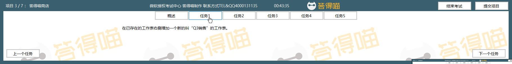
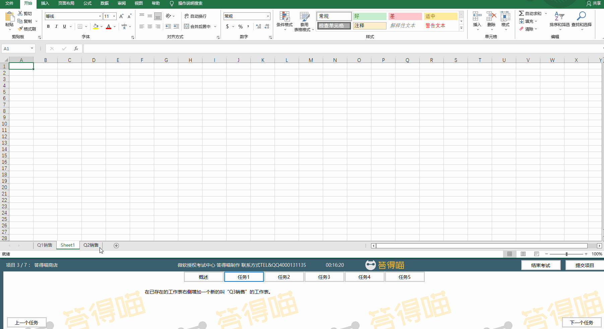
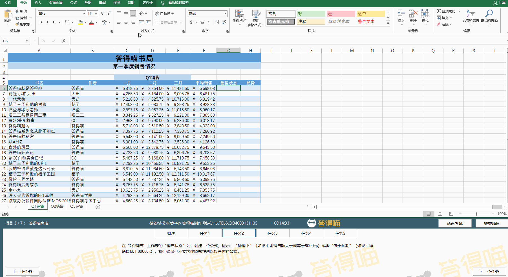
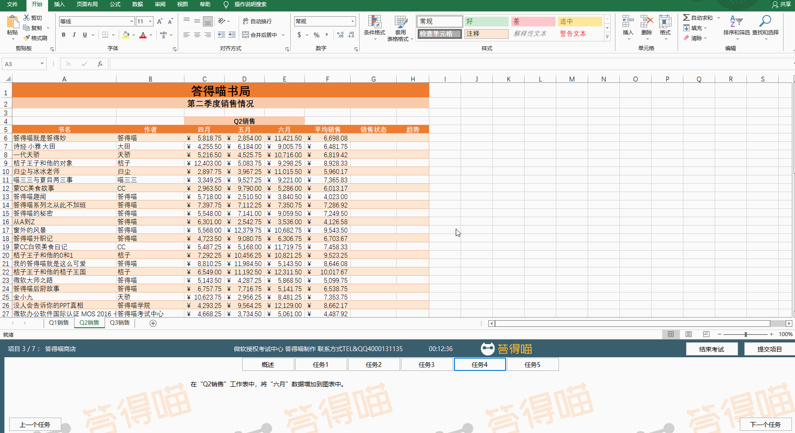
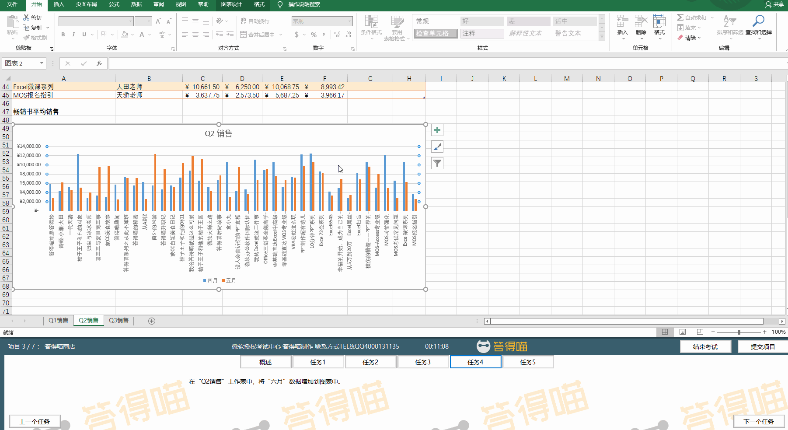
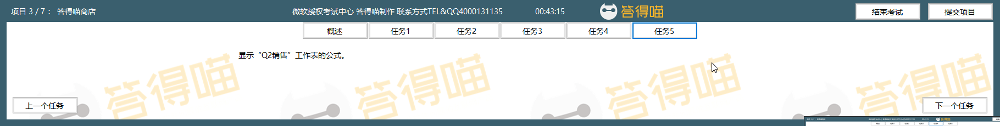
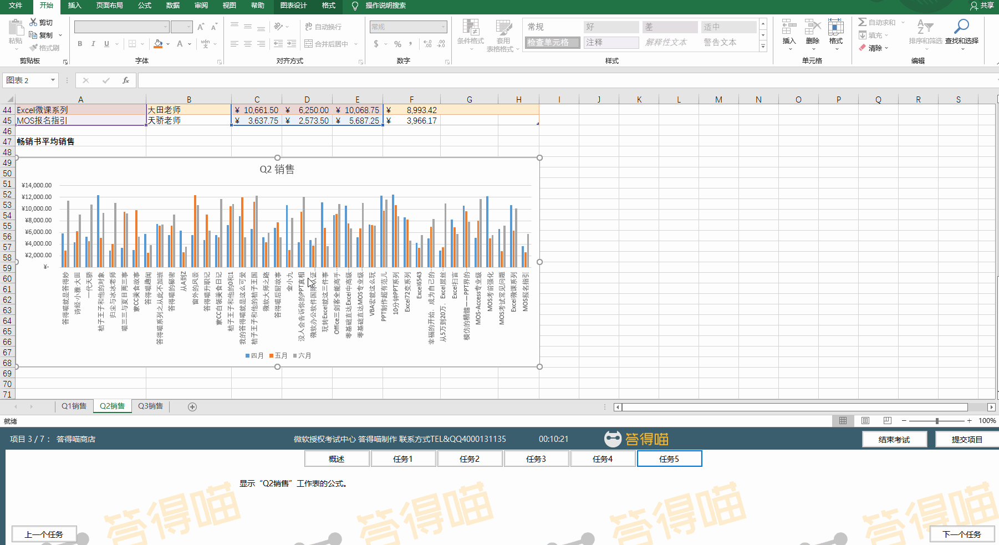

# Back to Main File
[Back](../README.md)

# Exercise File
[Core-Project3](MOS-Excel2016-Core-Project3.xlsx)

# Description
你有一个答得喵书店。你需要统计分析销售数据。

# Task 1
在已存在的工作表右侧增加一个新的叫“Q3销售”的工作表。

# Task 1 Answer

  
Click to see answer

# Task 2
在“Q1销售”工作表的“销售状态”列，创建一个公式，显示：“畅销书”（如果平均销售额大于或等于8000元）或者“低于预期”（如果平均销售低于8000元）。我们建议但不要求你填充整列以检查你的公式。

# Task 2 Answer

  
Click to see answer

# Task 3
在“Q1销售”工作表的“趋势”列，在每个单元格中插入一个折线迷你图显示“一月”到“三月”销售数据的趋势。

# Task 3 Answer

  
Click to see answer

# Task 4
在“Q2销售”工作表中，将“六月”数据增加到图表中。

# Task 4 Answer

  
Click to see answer

Method1:

Method2:

# Task 5
显示“Q2销售”工作表的公式。

# Task 5 Answer

  
Click to see answer

