# Back to Main File
[Back](../README.md)

# Exercise File
[Core-Project4](MOS-Excel2016-Core-Project4.xlsx)

# Description
答得喵书局销售图书和其他产品。在本项目中，你需要处理销售数据，以展示最佳销售图书的总销售情况。

# Task 1
在“销售”工作表，移除包含作者姓名的这一列。
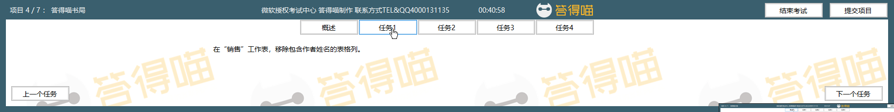
# Task 1 Answer

  
Click to see answer

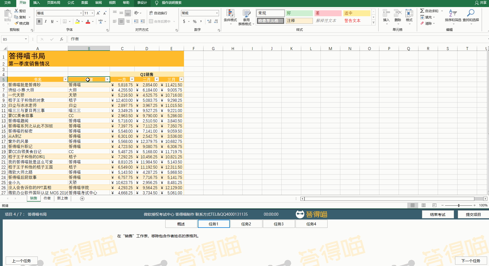

# Task 2
在“作者”工作表，移除表格的表功能性。保留字体和单元格格式设置和数据的位置。

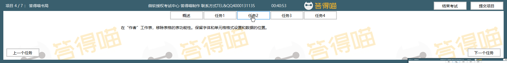
# Task 2 Answer

  
Click to see answer

添加表功能性Method1:

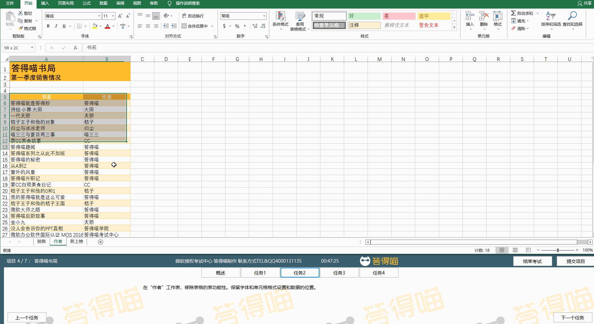

添加表功能性Method2:
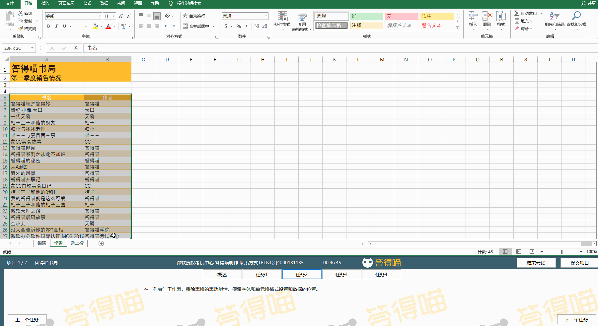

移除表功能性
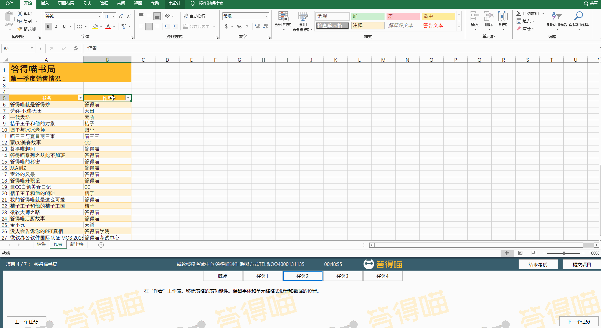

# Task 3
复制“销售”工作表的A9：A12单元格到“新上榜”工作表的A3:A6单元格。

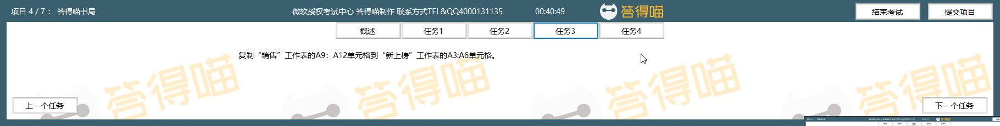
# Task 3 Answer

  
Click to see answer

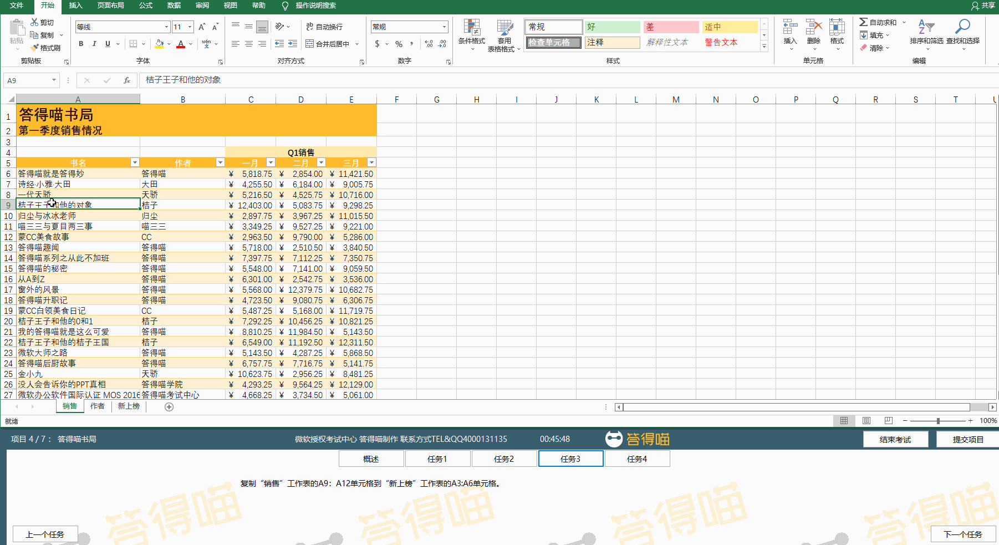

# Task 4
使用“销售”工作表第一季度（Q1）销售数据，插入一个3D堆积柱形图，展示每本书“一月”到“三月”的销售情况。书名展示在横轴，月份出现在图例。使用“第一季度销售”作为图表标题。

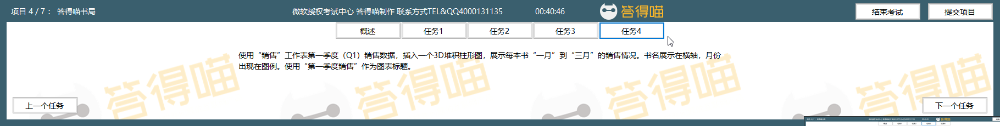
# Task 4 Answer

  
Click to see answer

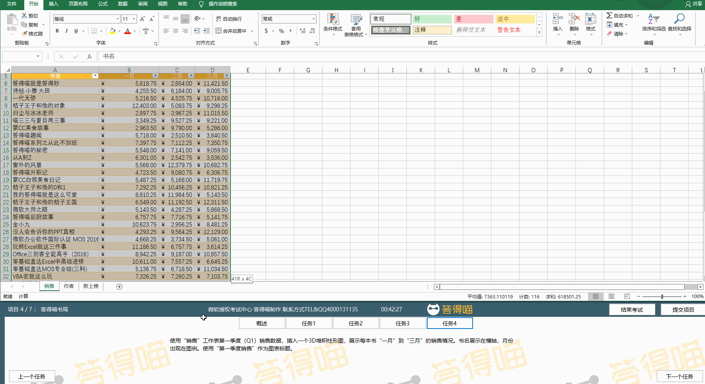

切换行列方法:
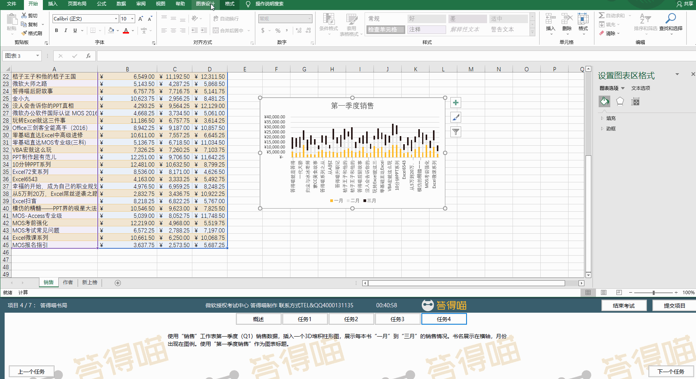

