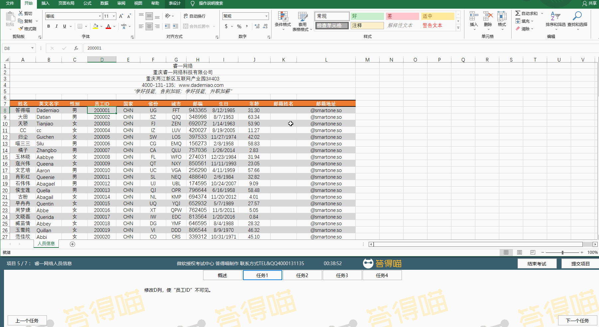
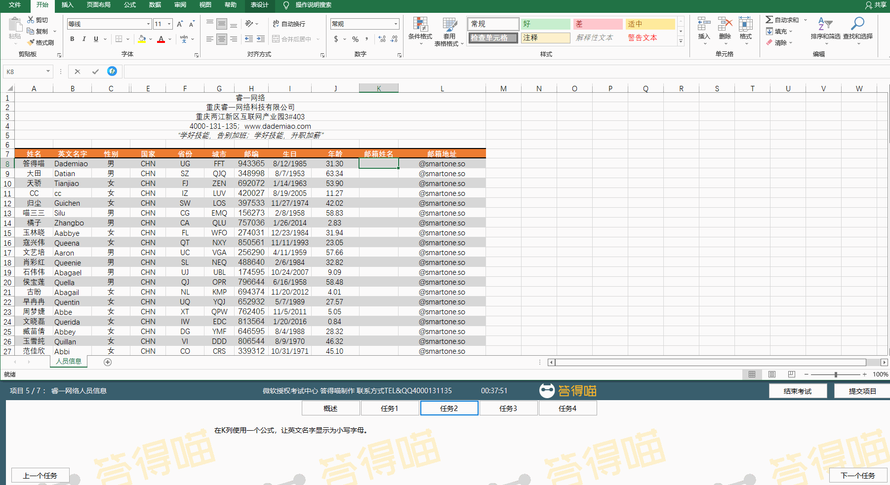
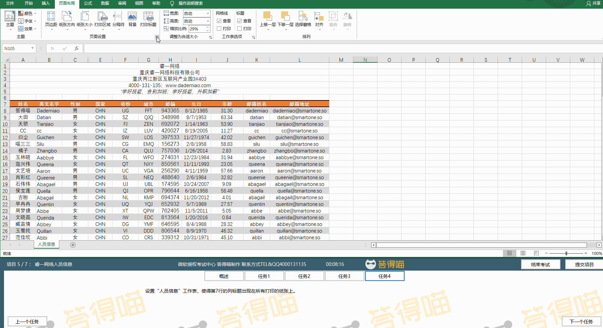

# Back to Main File
[Back](../README.md)

# Exercise File
[Core-Project5](MOS-Excel2016-Core-Project5.xlsx)

# Description
你在睿一网络公司工作，你正在更新公司的“人员信息”工作簿。

# Task 1
修改D列，使“员工ID”不可见。

# Task 1 Answer

  
Click to see answer

# Task 2
在K列使用一个公式，让英文名字显示为小写字母。

# Task 2 Answer

  
Click to see answer

# Task 3
定位到“答得喵lz”区域，并移除选中单元格的内容。

# Task 3 Answer

  
Click to see answer

# Task 4
设置“人员信息”工作表，使得第7行的列标题出现在所有打印的纸张上。

# Task 4 Answer

  
Click to see answer

