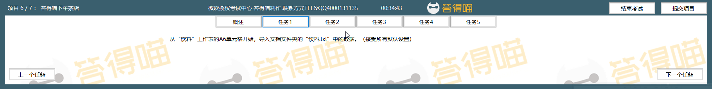

# Back to Main File
[Back](../README.md)

# Exercise File
[Core-Project6](MOS-Excel2016-Core-Project6.xlsx)

# Description
你是答得喵下午茶店的老板，卖一些饮料、茶和其他商品。你需要更新已存在的工作簿。

# Task 1
从“饮料”工作表的A6单元格开始，导入素材文件夹的“饮料.txt”中的数据。接受所有默认设置。（素材文件夹点击【查询文件夹】查看）

# Task 1 Answer

  
Click to see answer

# Task 2
对“茶”工作表上的表格，应用表格样式中等深浅9。

# Task 2 Answer

  
Click to see answer

# Task 3
在“茶”工作表，将柱形图的布局更改为布局9。增加“价格”作为纵轴标题。移除横轴标题。

# Task 3 Answer

  
Click to see answer

# Task 4
将“第一季度茶销售”工作表上的图表移动到名为“茶销售”的图表工作表中。

# Task 4 Answer

  
Click to see answer

# Task 5
将“茶”工作表上图表的轴的数据交换。

# Task 5 Answer

  
Click to see answer

