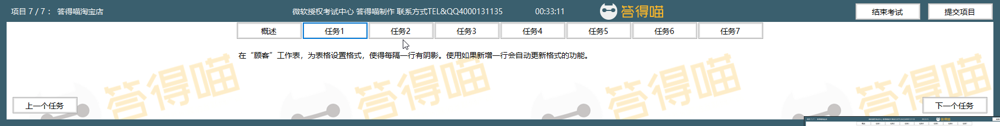

# Back to Main File
[Back](../README.md)

# Exercise File
[Core-Project7](MOS-Excel2016-Core-Project7.xlsx)

# Description
你有一家答得喵淘宝店，并已经将商品卖给过500个不同的顾客。你在评估和整理顾客数据。

# Task 1
在“顾客”工作表，为表格设置格式，使得每隔一行有阴影。使用如果新增一行会自动更新格式的功能。

# Task 1 Answer

  
Click to see answer

# Task 2
在“顾客”工作表，对表格内容排序，使“国家”列CHN在第一、RUS在第二。然后每个国家的顾客按照“省份”升序排列。最后每个省份的顾客按照“邮编”升序排列。

# Task 2 Answer

  
Click to see answer

# Task 3
在“顾客”工作表，在K2单元格键入一个公式，使用Excel函数，以返回基于“年龄”列的顾客平均年龄。

# Task 3 Answer

  
Click to see answer

# Task 4
在“产品”工作表，应用数值格式，使“重量”列的数字显示为三位小数。

# Task 4 Answer

  
Click to see answer

# Task 5
在“订单”工作表，使用自动化的格式设置方法，使得“总价”列的单元格中的值在平均值以上的应用深绿色文字绿色填充。当单元格中的值变化，格式应随之变化。

# Task 5 Answer

  
Click to see answer

# Task 6
在“订单”工作表，在J2单元格中键入一个公式，使用Excel函数，以返回“总价”中最高的那个。

# Task 6 Answer

  
Click to see answer

# Task 7
在“顾客与订单”工作表，使用Excel数据工具，以移除表格中具有重复“顾客ID”的记录。不要移除其他记录。

# Task 7 Answer

  
Click to see answer

