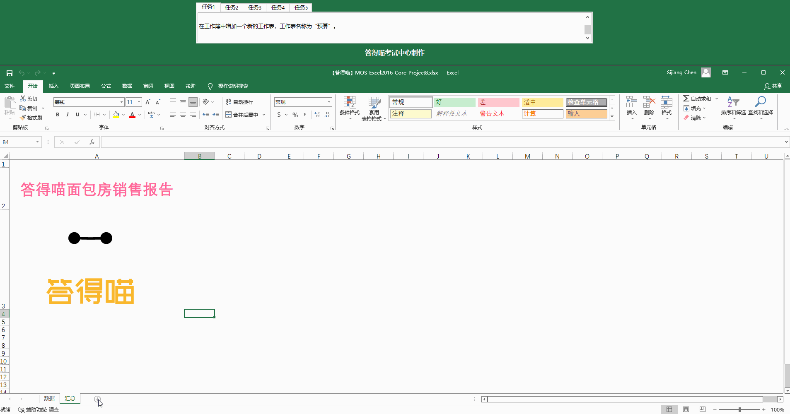
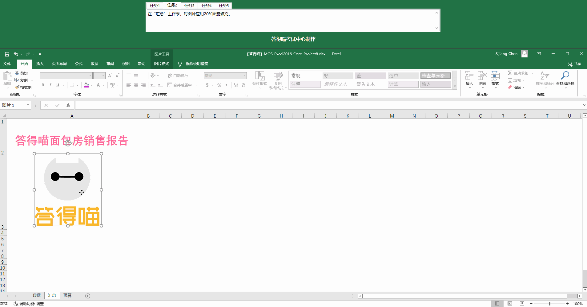
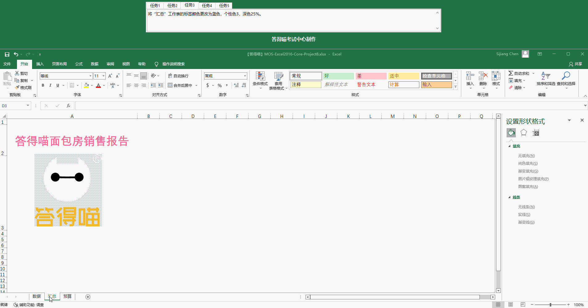
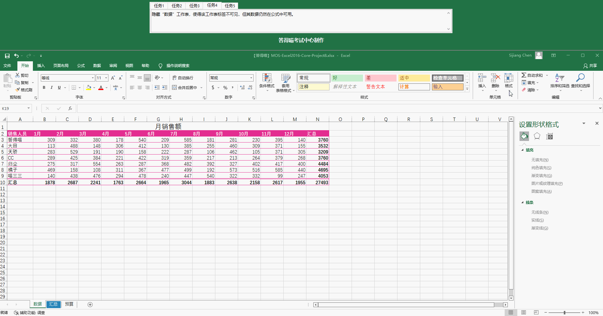
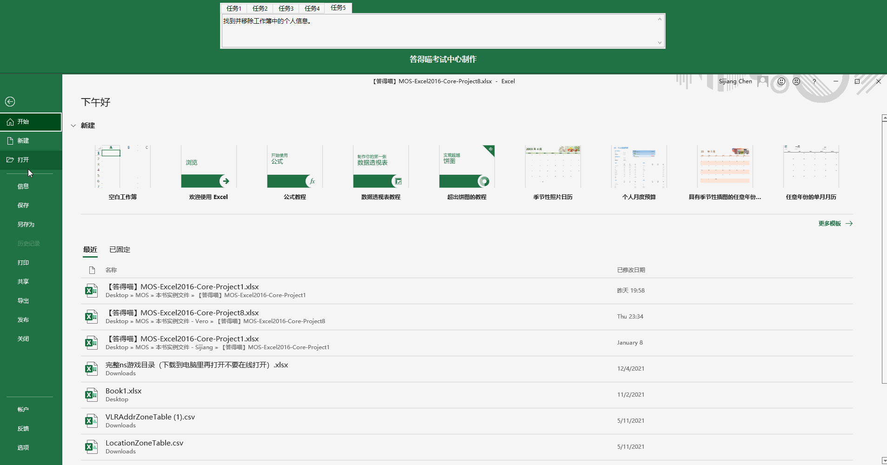

# Back to Main File
[Back](../README.md)

# Exercise File
[Core-Project8](MOS-Excel2016-Core-Project8.xlsx)

# Description
你在答得喵面包房工作。你在修改一个具有多个工作表的工作簿，以做出年度销售报告。
# Task 1
在工作簿中增加一个新的工作表，工作表名称为“预算”。
# Task 1 Answer

  
Click to see answer

# Task 2
在“汇总”工作表，对图片应用20%图案填充。
# Task 2 Answer

  
Click to see answer

# Task 3
在“汇总”工作表的标签颜色更改为蓝色，个性色3，深色25%。
# Task 3 Answer

  
Click to see answer

# Task 4
隐藏“数据”工作表，使得该工作表标签不可见，但其数据仍然在公式中可用。
# Task 4 Answer

  
Click to see answer

# Task 5
找到并移除工作簿中的个人信息。
# Task 5 Answer

  
Click to see answer

