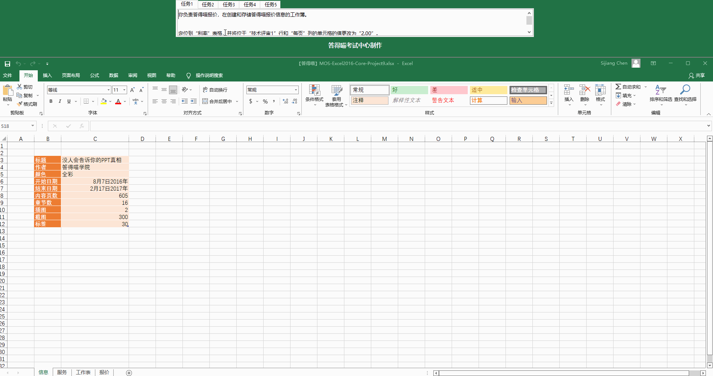
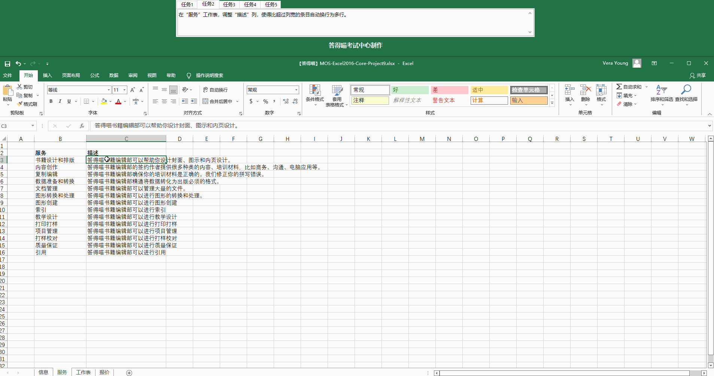
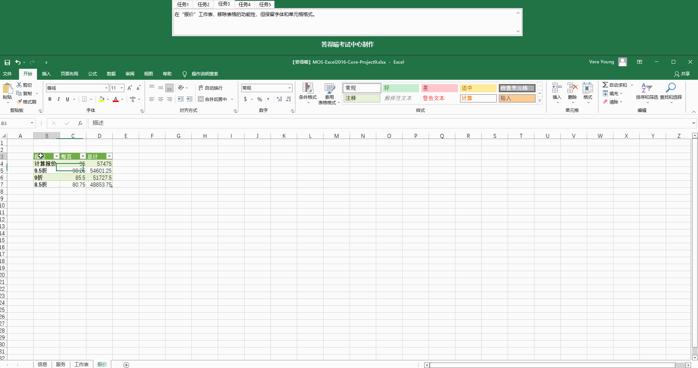
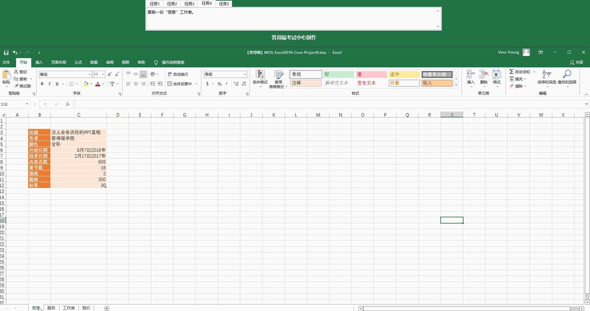
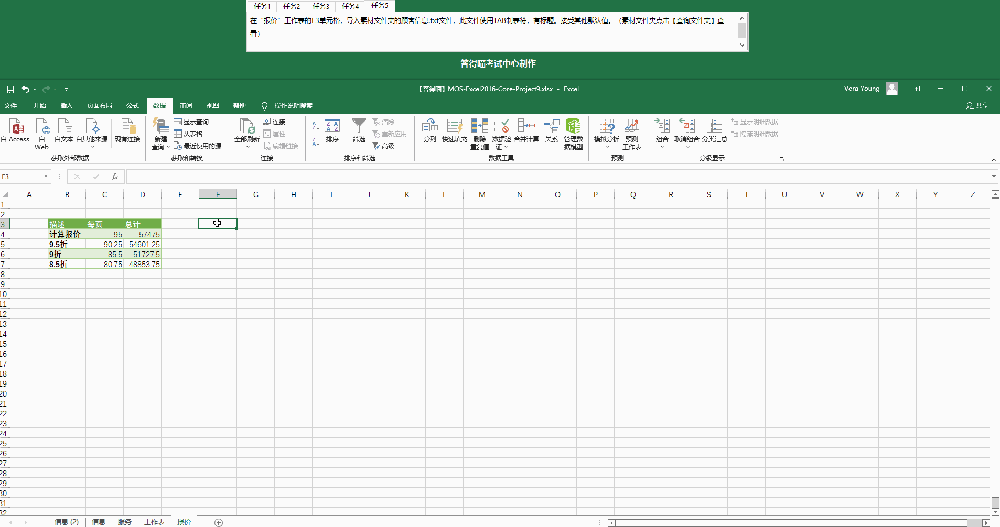

# Back to Main File
[Back](../README.md)

# Exercise File
[Core-Project9](MOS-Excel2016-Core-Project9.xlsx)

# Description
你负责答得喵报价，在创建和储存答得喵报价信息的工作簿。
# Task 1
定位到“利率”表格，并将位于“技术评审1”行和“每页”列的单元格的值更改为“2.00”。
# Task 1 Answer

  
Click to see answer

# Task 2
在”服务“工作表，调整”描述“列，使得比超过列宽的条目自动换行为多行。
# Task 2 Answer

  
Click to see answer

# Task 3
在”报价“工作表，移除表格的功能性，但保留字体和单元格格式。
# Task 3 Answer

  
Click to see answer

# Task 4
复制一份”信息“工作表。
# Task 4 Answer

  
Click to see answer

# Task 5
在”报价“工作表的F3单元格，导入顾客信息.txt文件，此文件使用TAB制表符，有标题。接受其他默认值。
# Task 5 Answer

  
Click to see answer

